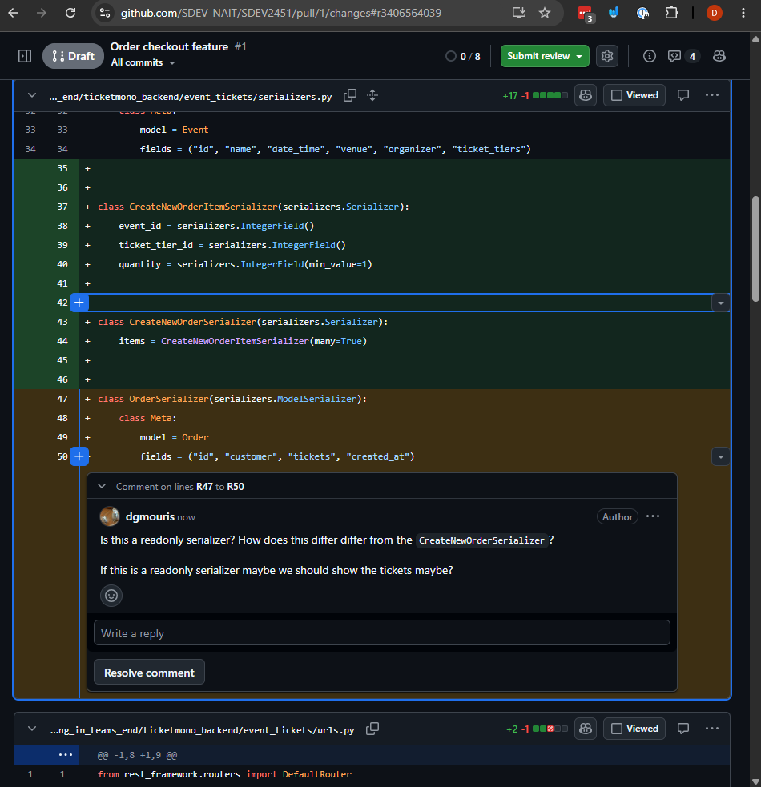
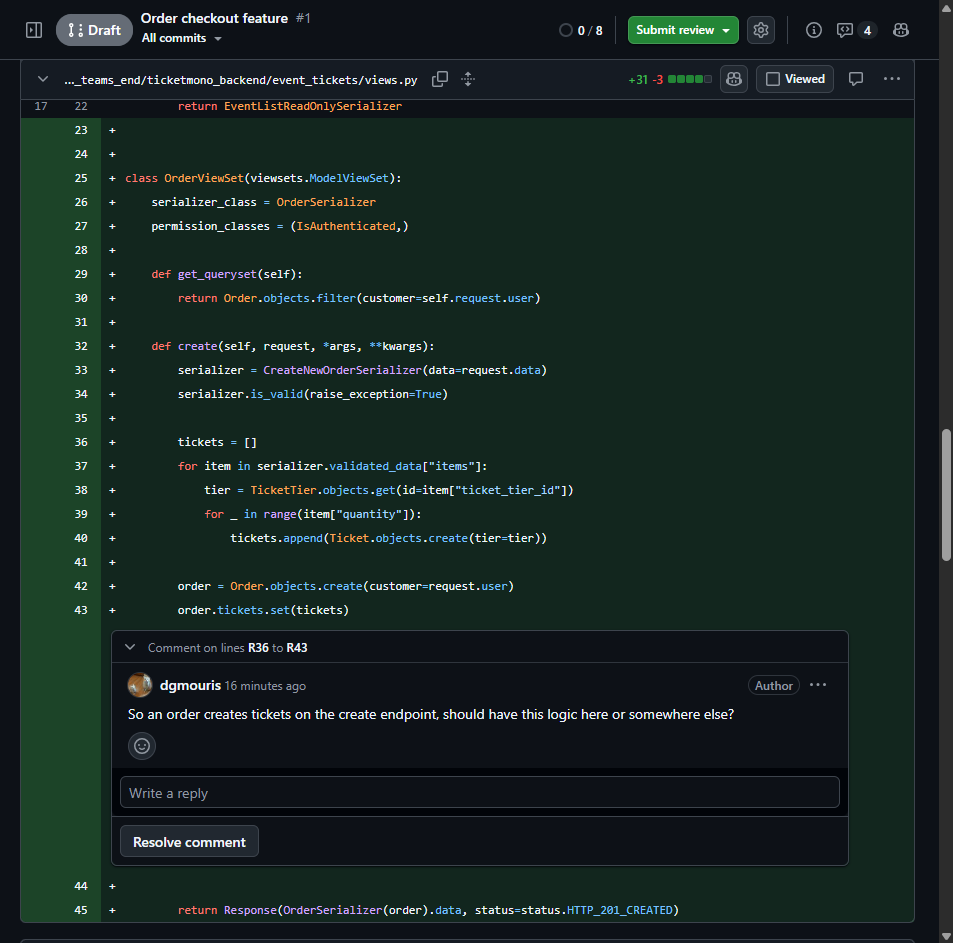
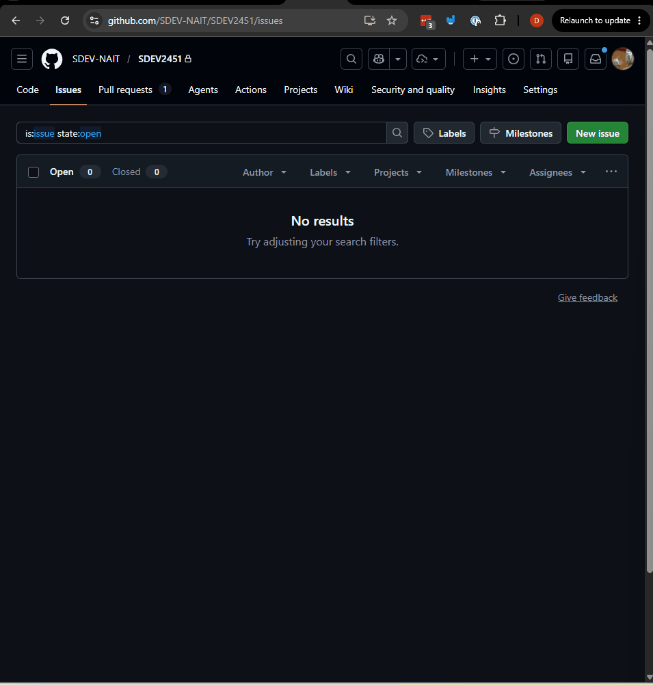
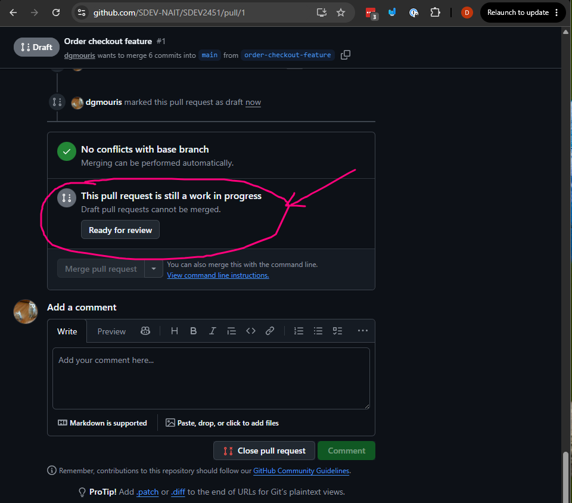
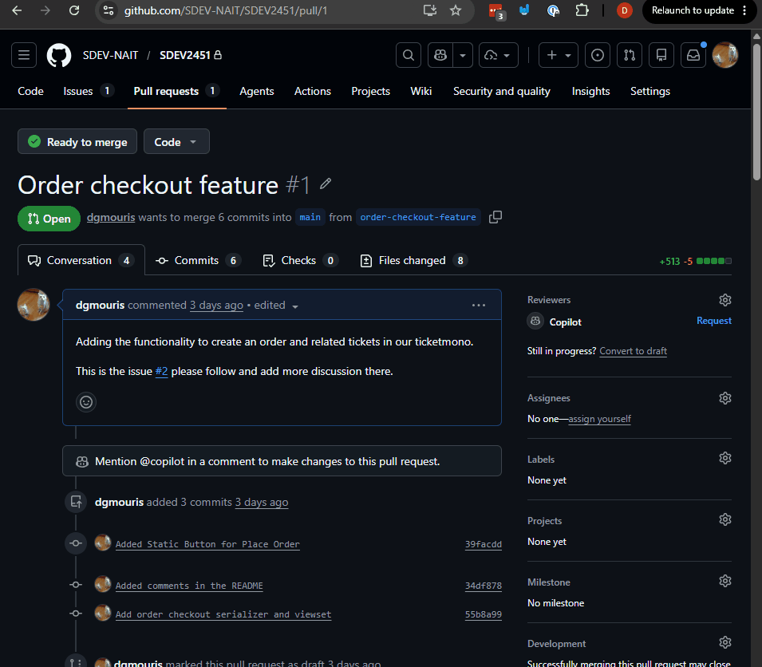
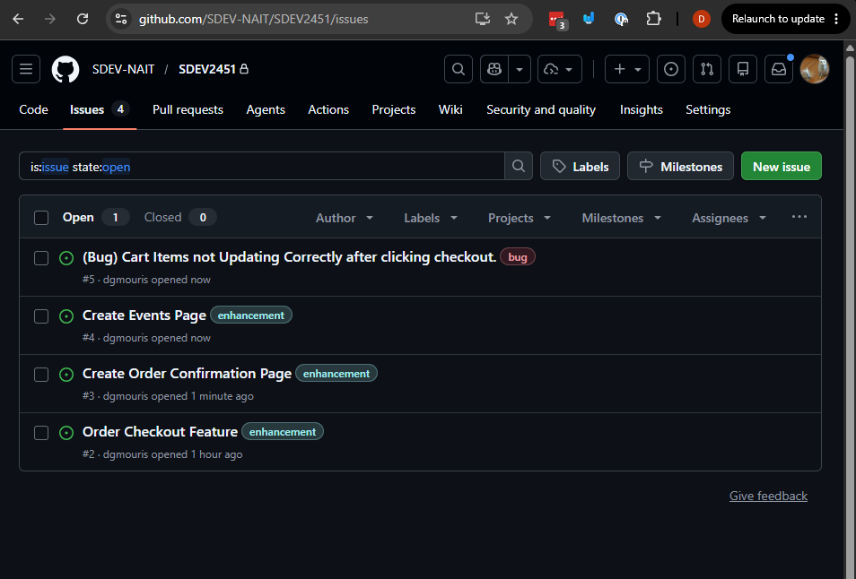
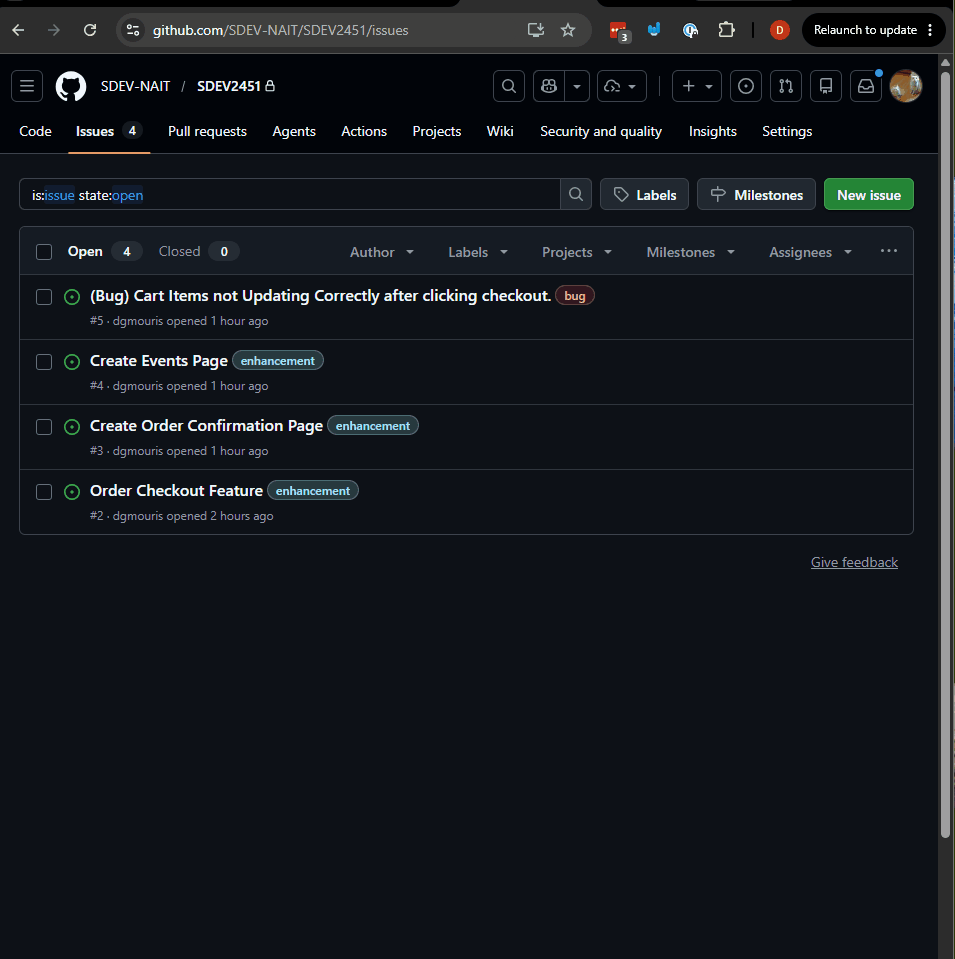
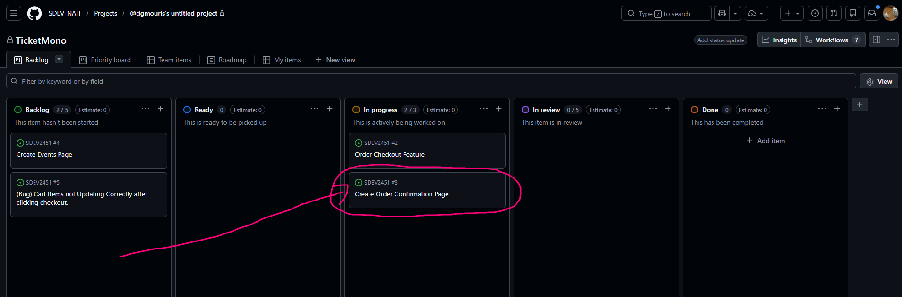
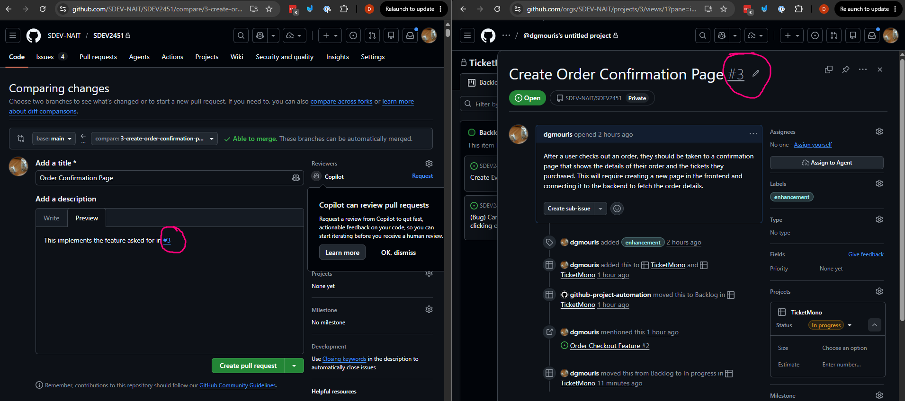
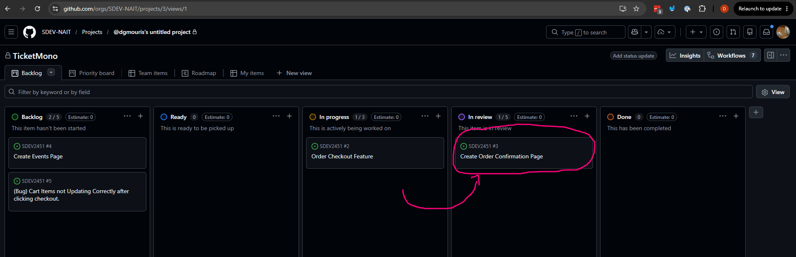

# Building in Teams — Code Reviews, Issues, and Project Boards

In the last example you built and shipped a feature through a pull request. This example zooms out and looks at how teams **organise** that work before a single line of code is written — using GitHub Issues to track tasks and GitHub Project Boards to keep everyone aligned on what's happening and who's doing it.

We'll also do a proper **code review** on the pull request from the previous example, so you can see what the review process looks like from both sides.

---

## How to Make a Change to a Large Project

This is the full team workflow you'll be following for every feature and bug fix. It's worth keeping in your head as a mental checklist.


### 1. **Create a branch locally** — `git checkout -b feature-name` (Completed in last example)

A branch is a separate line of development that allows you to work on a feature without affecting the main codebase. You can create a branch using the `git checkout -b` command followed by the name of your feature. For example, if you're working on a new login feature, you might create a branch called `login-feature` with the command `git checkout -b login-feature`. This will create a new branch and switch you to that branch so you can start making changes.

You will be creating branches for all features or bugs that are assigned to you.

### 2. **Make changes and commit** — `git add .` then `git commit -m 'your message'` (Completed in last example)

This step is what you folks are familiar with. You make changes to the codebase to implement the feature or changes. You use the same process that you folks have been using throughout your courses.

### 3. **Push the branch to GitHub** — `git push origin feature-name` (Completed in last example)

Once you've finished your changes and committed them locally this step pushes up the branch to GitHub.

### 4. **Open a Pull Request** — on GitHub, open a PR from your branch into `main` (Completed in last example)

This step is where you open a pull request on GitHub. The title and description of the pull request should explain what the change does and why. In this example you'll also see how to **link a pull request to a GitHub Issue** so the issue closes automatically when the PR merges.

### 5. **Code Review** — a teammate reviews, leaves comments, and approves (We'll be performing a code review in this example)

We'll be talking about this process more in detail today.

### 6. **Merge the Pull Request** — merge into `main` on GitHub (We'll do this at the end of the example)

This is the final step where you or your teammates will merge the pull request into the main branch and make it part of the source of truth for the project. When a PR is linked to an issue, merging it will automatically close that issue and move its card on the project board.

---

## What We'll Cover in This Example

- **Code Reviews** — reviewing the pull request from the previous example as a class, leaving inline comments, requesting changes, and approving
- **GitHub Issues** — creating issues to track features and bugs, writing clear titles and descriptions, and assigning them to team members
- **GitHub Project Boards** — setting up a board with columns (e.g. Backlog, In Progress, In Review, Done) and moving issues through the workflow as work progresses
- **Linking Issues to Pull Requests** — using `Closes #<issue-number>` in a PR description so the issue closes automatically on merge

---

## Steps

### 0. Let's Talk about what to look for in code reviews.

#### Let's Talk about Code Reviews.

The first few times you do code reviews it can be a bit intimidating but it's an essential part of working in a team in a way that maintains code quality and helps everyone learn from each other. The goal of a code review is to ensure that the code being merged into the main branch is of high quality, follows best practices, and meets the requirements of the issue it's addressing.

When reviewing a pull request, there's a lot to consider. Here's a general framework for how to approach a code review:

##### Micro problems/Decisions
  - Typos
  - logical incosistencies
  - things that might cause a bug
#####  Medium problems/Decisions
  - code smells
  - opportunity for refactors
  - Things that you can extras to cshare across other files.
#####  Macro problems/Decisions
  - Is this worth fixing?
    - More on this later today when we talk about github issues and project boards.
  - Is the right solution?
    - Is there a better solution?
  - Does it align with the great architecture?
    - Is this consistent with the rest of the codebase?
    - Does this fit with the overall design and architecture of the project?
  - Does it align with the plan/product?
    - Design Mockup
    - User Flow Diagram.
##### Clarification Questions
  - I don't get this decision
  - Could you add more comments about why this decision was made in the code.
  - Does this introduce dependencies that we have to install?
  - Just making sure that this works as the reviewer expected. (e.g. I click the button and this happens, is that right?)
- Documentation and standards.
  - Do we need to update the base readme?
  - Did you do enough tests?
    - More on this in the next module.
  - Does your PR match the style?
    - More on this in the next module.

#### What happens after a code review process:
Sometimes after a code review it might become clear that:
- The code needs some changes before it can be merged. In this case, the reviewer can request changes and the author will need to make those changes and push them up before the PR can be approved and merged.
- The code is good, but other discussions come up that might be worth tracking in a github issue. We'll talk more about this today.
- The code is good and can be approved and merged as is.
- The code is not relevant to the issue or feature that it's supposed to address (or is not addressing anything) and the reviewer might close the PR and ask the author to open a new PR that addresses a specific issue or feature.

### 1. Let's Do a Code Review on the PR from last class, and discuss a few examples.

On the PR from last class, Click the "Files Changed" tab to see the "diff" (the changes made)

We want to be respectful as we go through this but we also want to be honest and give constructive feedback that will help the code be better and also help the person who wrote the code learn and grow as a developer.

You don't need to be perfect, here's some sample comments that I've left on this PR to give you some sort of an idea.

1. Example 1: Asking for clarification decision in the code that might lead to a larger discussion on what needs to be implemented.


2. Example 2: This spurs discussion about if this is the right place to put this logic. Should the team put this in a different place.


3. Example 3: This is more of a design mockup/ user flow discussion.
![pr_comment_3](images/pr_comment_3.png

Let's discuss your ideas on what we can improve here.

### 2. Let's Talk about Github Issues.

When doing a code review you want to capture the ideas that come up in the code review as Github Issues so that they can be tracked and discussion about this can be had outside of pull requests.

#### What is a github issue?

At its core, a GitHub Issue is just a conversation tied to a repository. It's a thread where you can describe something — a problem, an idea, a question, a task — and discuss it with your team, all in the context of your codebase.
Think of it like a sticky note that never gets lost. Unlike a Slack message that scrolls away or a verbal conversation that gets forgotten, an issue lives permanently alongside your code.

**_Examples_** Take a look at the "issues" tab in most open source repositories.

#### Anatomy of a good Github Issue

##### 1. **Clear Titles**

A good issue starts with a clear, concise title that summarizes the problem or task. It should give anyone reading it a good idea of what the issue is about without needing to read the entire description.

##### 2. **Detailed Descriptions**
The description should provide all the necessary context for understanding the issue. This might include:
- A more detailed explanation of the problem or task
- Steps to reproduce a bug (if it's a bug report)
- Expected vs actual behavior
- Any relevant screenshots or error messages
- Links to related issues or pull requests (we'll show this shortly)

##### 3. **Labels and Assignees**
Using labels helps categorize issues (e.g., bug, enhancement, question) and makes it easier to filter and prioritize them. Assigning issues to team members clarifies who is responsible for addressing them.

You can also use the @username syntax in the issue description to mention specific team members who might be relevant to the issue or who you want to notify about it.

## 3. Let's Create a github issue for the feature we just implemented.


Let's create the following github issues based on the feature we've just implemented and link it to the pull request that we just reviewed.

**NOTE** This is normally done before the code is implemented but we're doing it after to show how we can link issues in a github pull request.

Here's an example of what this looks like:




### 4. Let's Merge this PR and also capture some of these thoughts in the issue.


#### 4.1 Draft to Ready for Review
So we had a few thoughts in our pull request about how we might want to make a separate page so that we can see the tickets of the applistion. Let's capture this thought in the issue, merge the PR. And then we can follow the same process to create this confirmation page.



_Note_ You don't need to mark the PR as draft if you don't want to, but it's a nice way for other team members/coworkers to see that this PR isn't ready but they can see you're working on it.

#### 4.2 Merging the Pull Request on Github

When you Merge a Pull Request it merges any commits from the feature branch (here `order-checkout-feature`) into the `main` branch.

This is the final step where your code become part of the main codebase.

Here we show approving the PR and then merging it into main.

- Note I can't approve my own Pull Request (which is a good thing) but you can approve it!

#### 4.3 Pull down changes after merging.

To pull down the changes after merging, you can switch to the main branch and pull the latest changes:

```
git checkout main
git pull origin main
```
Let's talk about what this does.
- `git checkout main` switches your local branch to `main` you can check which branch you're on with `git branch` or `git status`
- `git pull origin main` pulls the latest changes from the remote `main` branch on GitHub to your local `main` branch.

**IMPORTANT NOTE: Error on Uncommitted changes** sometimes you'll get an error when you try to pull down changes after merging that says something like "Your local changes to the following files would be overwritten by merge". This means that you have uncommitted changes in your local branch that conflict with the changes that were merged into main. To resolve this, you can either commit or stash your local changes before pulling down the latest changes from main. So the workflow is:
1. `git stash` (this saves your local changes temporarily and gives you a clean working directory)
2. `git pull origin main` (this pulls down the latest changes from main)
3. `git stash pop` (this applies your stashed changes back to your working directory, you might have to resolve some merge conflicts if there are any)

**IMPORTANT NOTE: Merge Conflicts** You may also get a merge conflict when you try to pull down the changes after merging.

A merge conlict when two people have made changes to the same lines of code in the file. Git won't know which changes to keep and will mark the file as having a merge conflict. To resolve this, you'll need to open the file with the merge conflict and manually decide which changes to keep. Git will mark the conflicting sections of the code with `<<<<<<<`, `=======`, and `>>>>>>>` to show you the different versions of the code. You'll need to edit the file to keep the changes you want and remove the conflict markers, then save the file and commit the resolved changes.

How to fix with rebasing:
1. `git pull --rebase origin main` (this will pull down the latest changes from main and reapply your local commits on top of the latest changes, this can help to avoid merge conflicts by replaying your commits on top of the latest changes from main)
2. If there are merge conflicts, Git will pause the rebase and allow you to resolve the conflicts manually. You do this by opening the conflicting files, looking for the conflict markers (`<<<<<<<`, `=======`, `>>>>>>>`), and editing the file to keep the changes you want while removing the conflict markers.
3. After resolving the conflicts, you can continue the rebase with `git rebase --continue`.

We'll fix these as we go along in your final project and maybe later on in the course as well when you have to pull down changes from your teammates.

## 5. Let's Talk about Github Project Boards.

In your other courses you've been talk about Kanban boards, or task boards or trello boards. Github has a built in project board feature that allows you to create boards with columns and cards to track the progress of your issues and pull requests.

### 5.1 Let's create a couple of issues and add them to the project.

Add the following issues to the github repository.

- Issue:
  - Title: Create Order Confirmation Page
  - Description: After a user checks out an order, they should be taken to a confirmation page that shows the details of their order and the tickets they purchased. This will require creating a new page in the frontend and connecting it to the backend to fetch the order details.
  - Labels: enhancement
- Issue:
  - Title: Create Events Page
  - Description: As an event organizer, I want to be able to create a new event with multiple ticket tiers so I can sell tickets for my event. This will require creating a new page in the frontend with a form to create the event and ticket tiers, and then connecting it to the backend to save the event and ticket tier data in the database.
  - Labels: enhancement
- Issue:
  - Title: (Bug) Cart Items not Updating Correctly after clicking checkout.
  - Description: After a user navigates away from the ticket selection page to the checkout page or any other page the cart items are not updating correctly and the user can end up with an inconsistent state in the frontend where they have items in their cart that they haven't actually checked out. This is a bug that needs to be fixed to ensure a smooth user experience.
  - Labels: bug

When you navigate to the issues tab your project it should look something like this:


We'll be creating issues like this for all of the features and bugs that we work on for the rest of this course.

### 5.2 Let's create a project board and add these issue to the project board.

Go to your project's "Projects" tab and create a new project. You can choose the "Kanban" template which will give you a board with three columns: "To Do", "In Progress", and "Done". You can customize these columns as well if you want.

Here's how to create the project:


We're doing a couple of things here:
1. Creating a new project board with the "Kanban" template.
2. Moving the issue from the backlog to the "In Progress" column as we're starting to work on it.
3. Mentioning the issue "Create Order Confirmation Page" in the issue description of "Order Checkout Feature"
    By adding the #number_of_issue in the description you'll see that it automatically links to the issue shown.

You we can take a look at the section ["What is a Kanban Board?"](#what-is-a-kanban-board) to talk about how to use the project board in your day-to-day work.

## 6. Let's create the order confirmation page doing the full workflow.

### 6.1 Move the "Create Order Confirmation Page" issue to the "In Progress" column on the project board.
- In this step you can also assign yourself to the issue so that your teammates/coworkers know that you're working on this issue. Shown below.


### 6.2 Create a new branch for this feature and start working on the static UI for the order confirmation page with tickets listed.
- It's normally good practice to create a branch with the issue number in the name so that it's clear which issue this branch is addressing.
  - so if the issue number for "Create Order Confirmation Page" is 3 then you can create a branch with the name `3-create-order-confirmation-page` using the command:
  `git checkout -b 3-create-order-confirmation-page`


### 7. Start Implementing the "Create Order Confirmation Page" Issue

We just created a GitHub Issue for the Order Confirmation Page and moved it to **In Progress** on the board. Now let's start building it — frontend first, with mock data, before connecting to the backend.

#### 7.1 Create the Page with Static Mock Data

Create a new file at `ticketmono_frontend/src/pages/attendee/OrderConfirmationPage.jsx`:

```jsx
import { useParams } from 'react-router-dom'

const mockOrder = {
  id: 1,
  tickets: [
    { id: 1, eventName: 'Summer Music Festival', tierName: 'General Admission', quantity: 2 },
    { id: 2, eventName: 'Summer Music Festival', tierName: 'VIP', quantity: 1 },
  ],
}

function OrderConfirmationPage() {
  const { id } = useParams()

  return (
    <div className="max-w-2xl mx-auto px-4 py-8">
      <div className="text-center mb-8">
        <h1 className="text-3xl font-bold mb-2">Order Confirmed!</h1>
        <p className="text-base-content/60">Order #{id}</p>
      </div>

      <div className="card bg-base-100 shadow">
        <div className="card-body">
          <h2 className="card-title text-lg mb-4">Your Tickets</h2>
          {mockOrder.tickets.map((ticket) => (
            <div
              key={ticket.id}
              className="flex justify-between items-center py-3 border-b border-base-300 last:border-0"
            >
              <div>
                <p className="font-semibold">{ticket.eventName}</p>
                <p className="text-sm text-base-content/60">
                  {ticket.tierName} × {ticket.quantity}
                </p>
              </div>
            </div>
          ))}
        </div>
      </div>
    </div>
  )
}

export default OrderConfirmationPage
```

**What's happening here:**

- `useParams()` reads the `:id` segment from the URL — when the backend is connected this will be the real order ID used to fetch data
- `mockOrder` is a hardcoded object that stands in for the API response — it has the same shape (`tickets` with `eventName`, `tierName`, `quantity`) that the backend will eventually return
- The `last:border-0` Tailwind class removes the bottom border from the final ticket row so the card doesn't have a double border at the bottom

The page is a **placeholder** — it shows the correct layout and structure, but the data is static. In a later step you will replace `mockOrder` with a real API call using the `id` from `useParams`.

#### 7.2 Register the Route in App.jsx

Open `ticketmono_frontend/src/App.jsx` and add the import and route:

```jsx
import OrderConfirmationPage from './pages/attendee/OrderConfirmationPage'
```

Then inside `<Routes>`, add the new route after the checkout route:

```jsx
<Route
  path="/orders/:id"
  element={<ProtectedRoute><OrderConfirmationPage /></ProtectedRoute>}
/>
```

You can now visit `/orders/1` in your browser to see the static confirmation page. The `1` in the URL is the mock order ID — `useParams` will return `{ id: "1" }` which is displayed as the order number.

##### Commit these changes with a clear message like "Add static order confirmation page" and push them up to GitHub

This is so your changes can be included in the pull request for review by teammates. This will help to ensure that all changes related to the feature are captured in the pull request and can be reviewed together before merging into the main branch.

#### 7.3 Update the Pull Request and Link to the Issue
We're not done this pull request so we'll make a draft and link the issue. We'll follow the same steps that we did you create a pull request in like we did in the last example.

1. Push the branch to GitHub with `git push --set-upstream origin 3-create-order-confirmation-page`
2. Create the pull request on GitHub from `3-create-order-confirmation-page` into `main` and in the description link the issue with `#<issue-number>` so that reviewers can see the context of the issue that this PR is addressing. This is shown below.

3. Mark the PR as "Draft" since it's not ready for review yet (this is in the top right corner of the PR page)

#### 7.4 Update the Backend to Return Nested Ticket Details

The current `OrderSerializer` only returns a list of ticket IDs. To display the event name, tier name, and price on the confirmation page the frontend needs the full ticket details — not just the IDs. We'll add a nested serializer that traverses the FK relationships and update the viewset to use it for the retrieve action.

**Step 1 — Add `TicketTierDetailSerializer`, `TicketDetailSerializer`, and `OrderDetailSerializer` to `serializers.py`**

Open `ticketmono_backend/event_tickets/serializers.py` and add these three classes below `OrderSerializer`:

```python
class TicketTierDetailSerializer(serializers.ModelSerializer):
    event_name = serializers.CharField(source="event.name", read_only=True)

    class Meta:
        model = TicketTier
        fields = ("id", "name", "price", "event_name")


class TicketDetailSerializer(serializers.ModelSerializer):
    tier = TicketTierDetailSerializer(read_only=True)

    class Meta:
        model = Ticket
        fields = ("id", "tier")


class OrderDetailSerializer(serializers.ModelSerializer):
    tickets = TicketDetailSerializer(many=True, read_only=True)
    total_price = serializers.DecimalField(
        max_digits=10, decimal_places=2, read_only=True
    )

    class Meta:
        model = Order
        fields = ("id", "customer", "tickets", "total_price", "created_at")
```

**What each piece does:**

- `TicketTierDetailSerializer` extends the existing `TicketTierSerializer` concept but adds `event_name`. The `source="event.name"` tells DRF to follow the FK from `TicketTier` to `Event` and read the `name` field. We create a separate serializer rather than modifying the existing `TicketTierSerializer` because that one is already used on the event list endpoint — adding `event_name` there would be redundant (you're already inside the event).
- `TicketDetailSerializer` nests `TicketTierDetailSerializer` as a `tier` field. This gives each ticket a structured `tier` object in the response rather than flat fields. The frontend accesses data as `ticket.tier.name`, `ticket.tier.price`, `ticket.tier.event_name`.
- `OrderDetailSerializer` nests `TicketDetailSerializer(many=True)` as `tickets` — replacing the default flat ID list with full ticket objects.
- `total_price` is a Python `@property` on the `Order` model, not a database column. Declaring it explicitly as `DecimalField(read_only=True)` tells DRF to include it in the output.

**Step 2 — Update `OrderViewSet` to use `get_serializer_class`**

Open `ticketmono_backend/event_tickets/views.py`. Replace `serializer_class = OrderSerializer` with a `get_serializer_class` method:

```python
from .serializers import (
    CreateNewOrderSerializer,
    EventListReadOnlySerializer,
    OrderDetailSerializer,
    OrderSerializer,
)

class OrderViewSet(viewsets.ModelViewSet):
    permission_classes = (IsAuthenticated,)

    def get_serializer_class(self):
        if self.action == "retrieve":
            return OrderDetailSerializer
        return OrderSerializer

    def get_queryset(self):
        return Order.objects.filter(customer=self.request.user)
```

> **Test it:** With the backend running, visit `http://localhost:8000/api/v1/orders/<id>/` (replacing `<id>` with a real order ID). The response should now include a `tickets` array where each element has an `id` and a nested `tier` object containing `id`, `name`, `price`, and `event_name` — instead of flat IDs.

**Step 3 - Commit these backend changes with a clear message like "Add Endpoint for order details" and push them up to GitHub**
- Commit your changes with a clear message.
- Push up your changes to github so that you can ensure that it's included in the pull request and can be reviewed by your teammates.


#### 7.5 Connect the Frontend to the Backend for Order Confirmation

The backend now returns real order details. The next step is to replace the mock data in `OrderConfirmationPage` with a live API call. Following the same layered pattern used for events, this means: one API function, one custom hook, and one updated page component.

**Step 1 — Add `fetchOrder` to `src/api/orders.js`**

The file already has `createOrder`. Add `fetchOrder` below it:

```javascript
export async function fetchOrder(id) {
  const res = await apiClient(`/orders/${id}/`)
  if (!res.ok) throw new Error('Failed to fetch order.')
  return res.json()
}
```

This hits `GET /api/orders/<id>/` — the retrieve endpoint now powered by `OrderDetailSerializer`.

**Step 2 — Create `src/hooks/useOrder.js`**

```javascript
import { useQuery } from '@tanstack/react-query'
import { fetchOrder } from '../api/orders'

export function useOrder(id) {
  return useQuery({
    queryKey: ['orders', id],
    queryFn: () => fetchOrder(id),
  })
}
```

`useOrder` follows the exact same pattern as `useEvent` — it takes an `id` parameter, includes it in the `queryKey` so each order gets its own cache entry, and passes it into the `queryFn`. The hook owns the async state; the component just reads it.

**Step 3 — Replace mock data in `OrderConfirmationPage.jsx`**

Remove the `mockOrder` constant and swap it for the hook:

```jsx
import { useParams } from 'react-router-dom'
import { useOrder } from '../../hooks/useOrder'

function OrderConfirmationPage() {
  const { id } = useParams()
  const { data: order, isLoading, isError } = useOrder(id)

  if (isLoading) {
    return <p className="text-center py-8">Loading your order...</p>
  }

  if (isError) {
    return <p className="text-center py-8 text-error">Failed to load order. Please try again.</p>
  }

  return (
    <div className="max-w-2xl mx-auto px-4 py-8">
      <div className="text-center mb-8">
        <h1 className="text-3xl font-bold mb-2">Order Confirmed!</h1>
        <p className="text-base-content/60">Order #{order.id}</p>
      </div>

      <div className="card bg-base-100 shadow">
        <div className="card-body">
          <h2 className="card-title text-lg mb-4">Your Tickets</h2>
          {order.tickets.map((ticket) => (
            <div key={ticket.id} className="py-3 border-b border-base-300 last:border-0">
              <p className="font-semibold mb-1">{ticket.tier.event_name}</p>
              <div className="flex justify-between items-center">
                <p className="text-sm text-base-content/60">{ticket.tier.name} × 1</p>
                <p className="font-medium">${parseFloat(ticket.tier.price).toFixed(2)}</p>
              </div>
            </div>
          ))}
          <div className="flex justify-between pt-4 font-bold text-lg">
            <span>Total</span>
            <span>${parseFloat(order.total_price).toFixed(2)}</span>
          </div>
        </div>
      </div>
    </div>
  )
}
```

**What changed and why:**

- `useOrder(id)` is called with the `id` from `useParams` — the URL drives the fetch automatically
- `isLoading` and `isError` guards prevent the component from trying to render `order.tickets.map(...)` before data has arrived, which would crash with a `Cannot read properties of undefined` error
- `ticket.tier.event_name`, `ticket.tier.name`, and `ticket.tier.price` now come from the real backend response — the nested structure matches exactly what `TicketDetailSerializer` returns (a `tier` object containing the tier and event details)
- `parseFloat(order.total_price).toFixed(2)` converts the DRF decimal string (e.g. `"25.00"`) to a formatted number for display
- The `mockOrder` constant is gone entirely — there is no fallback, which is intentional. If the API call fails, the `isError` state handles it gracefully

> **The complete picture:** The URL `/orders/3` triggers `useOrder("3")`, which calls `fetchOrder("3")`, which hits `GET /api/orders/3/`. The backend's `OrderViewSet.retrieve` action runs, uses `OrderDetailSerializer`, and returns the order with nested ticket objects. React Query caches the result under the key `['orders', '3']`, so navigating back to the same page does not fire a second request.

**Step 4 - Commit and push changes**

Commit your changes with a clear message like "Connect order confirmation page to backend" and push them up to GitHub so they can be included in the pull request for review by teammates.

#### 7.6 Redirect to the Order Confirmation Page After Placing an Order

Right now, clicking "Place Order" creates the order but leaves the user sitting on the checkout page. The backend returns the new order object (including its `id`) in the response — we should use that `id` to send the user straight to their order confirmation page.

React Router provides `useNavigate` for this. It gives you a `navigate` function you can call imperatively (i.e., in response to an event, not during render), which is exactly what we need here.

Open `src/pages/attendee/CheckoutPage.jsx` and make the following changes:

**1. Import `useNavigate`**

```jsx
import { useNavigate } from 'react-router-dom'
```

**2. Call `useNavigate` inside the component and remove `isSuccess` from the destructured hook**

```jsx
const navigate = useNavigate()
const { mutate, isPending } = useCreateOrder()
```

We no longer need `isSuccess` because instead of rendering a static success message, we'll navigate away immediately when the order is created.

**3. Pass an `onSuccess` callback to `mutate`**

```jsx
mutate(orderItems, {
  onSuccess: (order) => {
    navigate(`/orders/${order.id}`)
  },
})
```

`mutate` accepts an optional second argument with lifecycle callbacks. `onSuccess` receives the data returned by the API — which is the newly created order object — so `order.id` is the real database ID we need to build the URL.

**4. Remove the `isSuccess` early-return block**

Delete the `if (isSuccess) { ... }` block entirely. Navigation replaces it — as soon as `onSuccess` fires, React Router takes the user to `/orders/<id>` and the checkout page unmounts.

The full updated `handlePlaceOrder` function looks like this:

```jsx
function handlePlaceOrder() {
  const orderItems = cartItems.map((item) => ({
    event_id: item.eventId,
    ticket_tier_id: item.tierId,
    quantity: item.quantity,
  }))
  mutate(orderItems, {
    onSuccess: (order) => {
      navigate(`/orders/${order.id}`)
    },
  })
}
```

**Why pass the callback to `mutate` instead of using `onSuccess` in `useMutation`?**

`useMutation` also accepts an `onSuccess` option, but callbacks passed there don't receive the mutation result in the same reliable way across React Query versions. More importantly, navigation is a side effect that belongs in the component that triggers the action — not in the hook, which should stay focused on the API call. Passing `onSuccess` to `mutate` keeps the navigation logic next to the button that caused it.

> **Test it:** With both the backend and frontend running, add a ticket to the cart, go to the checkout page, and click "Place Order". You should be redirected to `/orders/<id>` where the order confirmation page displays your real ticket details fetched from the backend.

## 8. Change the issue to "Ready To Review" and move this Issue to "In Review" on the github project board and ask a teammate to review the PR.
- We're going to review the PR and make sure that it addresses the issue. It already does so we can approve this.



## 9. Merge the PR after approval and move the issue to "Done" on the github project board. Locally switch to the main branch and pull down the changes.
- Merge the PR on GitHub after approval. This will automatically close the issue (because we linked it in the PR description) and you can move the card to "Done" on the project board.
- After merging, switch to the main branch locally and pull down the latest changes with `git checkout main` and `git pull origin main`.


## 10. Celebrate! Repeat this process for every feature and bug fix you work on for the rest of the course.

- This is the entire workflow that you'll be using for features and bug fixes for the rest of the course, your final project, and your career as a software developer. It might feel slow at first but it will get faster with practice and it's the industry standard for how teams build software together while maintaining code quality and shared understanding of the codebase.

---

## What is a Kanban Board?

A **Kanban board** is a visual tool for managing work. It shows every task your team is tracking as a card, and organises those cards into columns that represent stages of progress. At a glance, anyone on the team can see what needs to be done, what's being worked on right now, and what's finished — without needing to ask anyone.

The word "Kanban" comes from Japanese manufacturing (Toyota) and means roughly "visual signal." The idea is simple: make the state of all work visible so the team can coordinate without constant meetings or status emails.

**The columns we'll use:**

| Column | Meaning |
|---|---|
| **Backlog** | Ideas and tasks that have been captured but not yet prioritised or scheduled — the raw list of everything the team might work on |
| **Ready** | Work that has been approved and scoped and is ready to be picked up — someone could start this right now |
| **In Progress** | Work actively being done right now — ideally by one person per card |
| **In Review** | A pull request has been opened and is waiting for a teammate to review and approve it |
| **Done** | Work that is complete and merged (or closed) |

**How to use it day-to-day:**

1. **Start of work** — pick an issue from the **Ready** column and drag it to **In Progress**. This signals to teammates that you own this piece of work.
2. **While working** — the card stays in **In Progress** until you open a pull request. If you're blocked (waiting on a decision or a dependency), say so in the issue comments so the team can see it.
3. **Pull request opened** — move the card to **In Review**. This tells teammates that the code is written and waiting for their feedback. The reviewer leaves comments, you make any requested changes, and when it's approved the PR can be merged.
4. **After merging** — the card moves (or closes automatically if you used `Closes #<number>`) to **Done**. The issue closes and the board updates.
5. **Limit work in progress** — a healthy team tries not to have too many cards **In Progress** at once. If everyone has five cards in progress, nothing is getting finished. Aim to finish something before starting something new.

**Why bother?**

Without a board, the team's work is invisible. You don't know if two people are working on the same thing, if something critical is blocked, or if the sprint is on track. A Kanban board costs almost nothing to maintain (moving a card takes five seconds) and gives the whole team shared situational awareness — especially important when working remotely or asynchronously.

> **For your final project:** You and your teammates should be moving cards on your project board every class. If your board hasn't changed in a week, that's a signal something is wrong — either work isn't being captured as issues, or the board isn't being kept up to date.

---

## Conclusion

In this example you went through the full team development lifecycle — from planning work all the way to merging a reviewed pull request. Here's what you covered:

- **Code reviews** — you reviewed the pull request from the previous example, left inline comments, and saw how feedback leads to discussion and eventual approval
- **GitHub Issues** — you created an issue to track the order confirmation feature, giving it a clear title, description, and assignee so the work was visible to the whole team
- **GitHub Project Boards** — you set up a Kanban board with Backlog, Ready, In Progress, In Review, and Done columns, and moved the issue through those stages as work progressed
- **Linking Issues to Pull Requests** — you used `Closes #<issue-number>` in the PR description so the issue closed automatically when the PR was merged
- **Nested serializers** — on the backend, you added `TicketDetailSerializer` and `OrderDetailSerializer` so the order detail endpoint returns full ticket information instead of flat IDs
- **`get_serializer_class`** — you updated `OrderViewSet` to return the lightweight `OrderSerializer` for list actions and the detailed `OrderDetailSerializer` only for the retrieve action
- **Connecting the frontend** — you added `fetchOrder` to `orders.js`, created the `useOrder` hook with TanStack Query, and updated `OrderConfirmationPage` to display real data from the backend with proper loading and error states

The workflow you practised here — branch, commit, push, open PR, link issue, review, merge — is the standard way software is built on professional teams. Keep using it for every feature and bug fix for the rest of the course.
