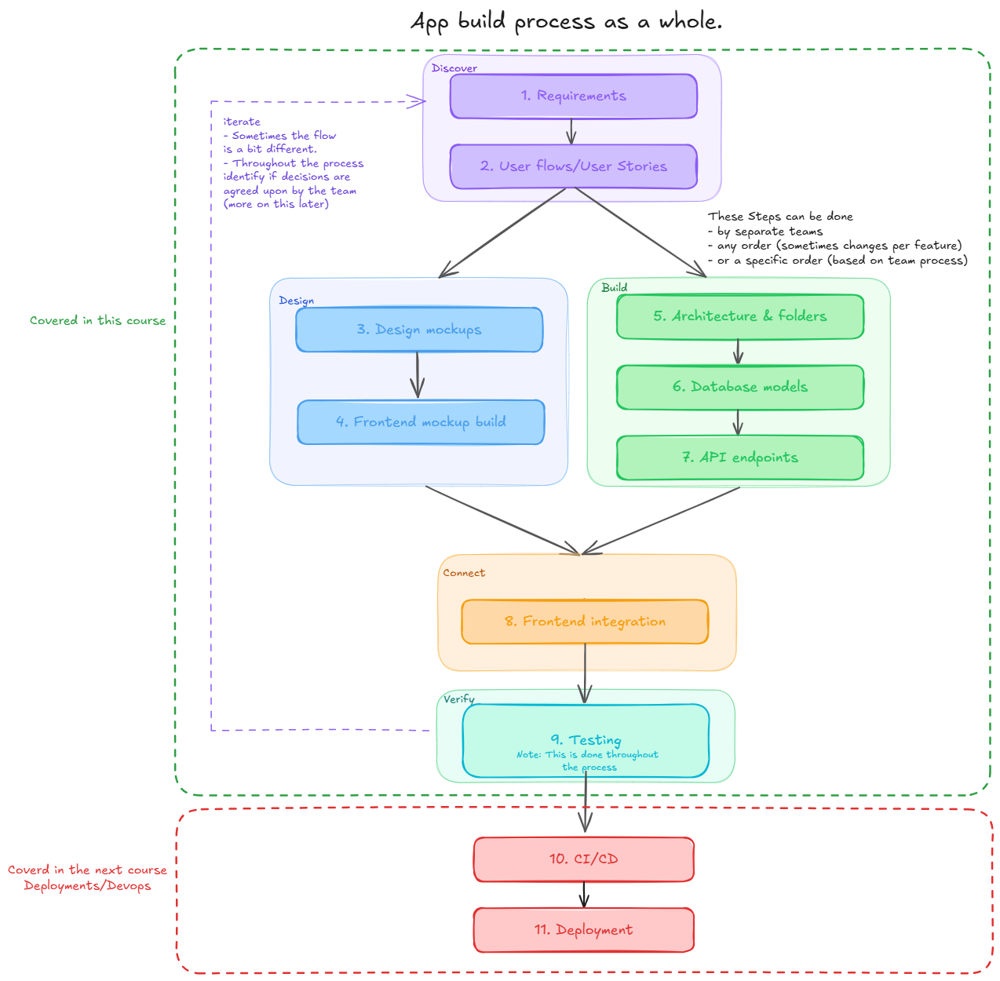
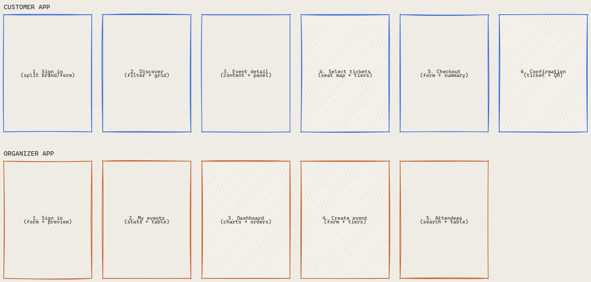

# Planning and Architecting a Full-Stack Application from Scratch

This lesson introduces the end-to-end process of building a full-stack application — from gathering requirements to deploying a working product. Rather than writing code, we focus on the thinking, planning, and decision-making that happens before a single file is created.

## Prerequisites

No code setup is required for this lesson. All you need is the `images/` folder in this directory.

---

## Steps

In previous examples we worked with an existing codebase — there was already a running backend and a React frontend to connect or extend. In this lesson we zoom all the way out and ask: how do you build something from scratch?

We will walk through each phase of the full-stack development lifecycle using a **concert/events ticketing app** as our case study.

---

### 0. Understand the full development lifecycle

Before diving into any one phase it helps to have the big picture in front of you. Building a full-stack app is not a single straight line from idea to deployment — it is a set of overlapping phases carried out by different people (or the same person wearing different hats).

Let's talk about what this diagram is showing.
- The lifecycle has five major phases: **Discovery and Planning**, **Design and Prototyping**, **Building the Backend**, **Connecting Frontend to Backend**, and **Testing**.
- **Design and Prototyping** and **Building the Backend** can happen in parallel. Designers can finalize mockups while backend engineers are setting up models and endpoints — neither team needs to wait for the other to finish.
- **Testing** is shown at the end, but in practice tests are written alongside every other phase. The diagram places it last because the *final* verification pass (end-to-end testing) can only happen once both the frontend and backend are connected.
- The phases outside this course — **CI/CD** and **Deployment** — are shown so you know where they fit, even though we will not implement them here.

---

### 1. Gather requirements and define the MVP

The first step in any project is understanding what you are actually building. This is called **Requirements Gathering**, and the goal is to define the **Minimum Viable Product (MVP)** — the smallest version of the app that delivers real value.

Let's talk about what this phase involves.
- An **MVP** is not a half-finished product — it is a deliberately scoped product. You choose which features are essential for the first release and defer everything else. For our ticketing app the MVP might be: browse events, purchase a ticket, and view your tickets. A recommendation engine or a resale marketplace can come later.
- Requirements can come from many sources: a client brief, user interviews, competitive analysis, or your own research. The output is a written list of features the app must have (and, equally important, must not have) in its first release.
- In industry, requirements are often captured in a **Product Requirements Document (PRD)** or a set of user stories. In this course we will work from a simpler list of features.
- Getting requirements right early is the highest-leverage activity in the process. A feature misunderstood at this stage costs minutes to fix now and weeks to fix after the backend, frontend, and tests have all been built around the wrong assumption.

---

### 2. Map out user flows

With requirements in hand, the next step is to understand how a user will actually move through the app. A **user flow diagram** captures this as a set of paths — the screens a user visits, the decisions they make, and the actions they take.

Let's talk about what this diagram is showing.
- A **user flow** maps the journey of a specific type of user through the app. Our ticketing app likely has at least two: a **buyer** who browses and purchases tickets, and an **organizer** who creates and manages events.
- Each box in the diagram represents a screen or state. Arrows represent actions (clicking a button, submitting a form) or decisions (is the user logged in?).
- User flows help you discover screens and features you might have missed. For example, drawing the "purchase a ticket" flow might reveal that you need a confirmation email step that was not in the original requirements.
- **User stories** are the written equivalent: short, first-person descriptions of a feature from the user's perspective ("As a buyer, I want to search for events by date so that I can find shows near me."). We will explore user stories in more detail when we cover building in teams.
- Both user flows and user stories feed directly into the next phases: the UI designer uses flows to decide which screens to mock up, and the backend engineer uses them to decide which API endpoints are needed.

---

### 3. Create and analyze design mockups

Once you know what the app does and how users move through it, a designer (or you) creates **design mockups** — visual representations of each screen before any code is written.

Let's talk about what design mockups give you.
- A mockup lets you make layout, colour, and interaction decisions in a low-cost environment. Changing a button from a primary colour to an outline style takes seconds in a design tool and hours if the component is already built and in use across ten pages.
- Mockups are a communication tool. Showing a stakeholder or teammate a mockup produces much more useful feedback than describing the feature in words — people can point at specific elements and say "this should be a dropdown, not a text field."
- When a frontend engineer receives a mockup, their job is to **break it down into components**: identify which pieces already exist, which need to be built, and which a component library like DaisyUI handles automatically. We did exactly this analysis in the previous example (example 5).
- Not every screen needs a pixel-perfect mockup. High-traffic or high-complexity screens (the event listing page, the checkout flow) benefit from detailed mockups. Simple internal screens (an admin dashboard) can be built directly.

---

### 4. Plan the frontend static build

With mockups approved, the frontend work can begin — even before the backend exists. The approach is to **build components with mock data first**, using static fixtures that mirror the shape of the API response you expect to receive.

Let's talk about why this order matters.
- Building with mock data lets you focus entirely on **layout, styling, and component structure** without needing a running server. You can develop, iterate, and review the UI at full speed.
- The key rule is that your mock data must mirror the API response shape exactly. If the API will return `{ vehicle_detail: { make: "Ford", ... } }`, your mock data should too. That way swapping mock data for real data later is a one-line change in the page component — the components themselves do not change.
- This phase also forces you to think about **component architecture** early: which components are reusable, which are page-specific, and where state should live. These decisions are much cheaper to make with mock data than after the backend is wired up.
- Breaking the mockup into components gives you a clear task list before you open a single file: "build `EventCard`, build `TicketForm`, wire them together in `EventDetailPage`."

---

### 5. Design the backend architecture

While the frontend is being built, the backend team can work in parallel. The first backend task is **architecture** — deciding how the project is structured before writing any models or views.

Let's talk about the key decisions in this phase.
- **App structure**: Django projects are divided into apps. Each app should own a cohesive domain of the product. Our ticketing app might have a `core` app (custom user model, shared utilities), a `ticketing` app (events, tickets, orders), and a `messaging` app (email notifications) if that feature is in scope.
- **Model relationships**: Before writing any code, sketch out the models and how they relate to each other. Which models have foreign keys to which? Is there a many-to-many relationship between events and venues? Getting this right early avoids painful migrations later.
- **Folder and file conventions**: Consistent naming and folder structure makes the codebase easier to navigate. In this course we follow the pattern established by earlier examples: one `serializers.py`, one `views.py`, one `urls.py` per app, with `permissions.py` for custom permission classes.
- Good architecture decisions at this stage save significant refactoring effort later. A model relationship that is wrong is not just a code change — it is a data migration on a live database with real user data.

---

### 6. Build models and run migrations

With the architecture decided, the backend engineer creates the **Django models** — the Python classes that define the database schema.

Let's talk about what this phase covers.
- Each model class maps to a database table. Fields on the model map to columns. Django's ORM handles the SQL — you write Python and Django generates the database instructions.
- After creating or changing models, you run `python manage.py makemigrations` to generate a migration file and `python manage.py migrate` to apply it. Migrations are the version history of your database schema — they should always be committed to version control.
- Defining models early also defines the **data contract** between the backend and the frontend. Once a model is stable, the serializer and API layer can be built on top of it, and the frontend team knows exactly what fields will be available in the API response.
- It is worth spending time on model design because models are the hardest thing to change later. Adding a field is easy; removing one, renaming one, or changing a relationship type requires careful migration work and potential data transformation.

---

### 7. Design and implement API endpoints

With models in place, the backend engineer creates the **API layer** — the serializers, viewsets, and URL routes that expose the data to the frontend.

Let's talk about what good API design looks like.
- **Serializers** control which fields are exposed and how they are shaped. They are also where input validation lives — a serializer rejects invalid data before it ever reaches the database.
- **ViewSets** map HTTP verbs to actions. A `ModelViewSet` gives you `list`, `retrieve`, `create`, `update`, and `destroy` for free. Custom `@action` decorators add non-CRUD operations like `POST /events/{id}/publish/`.
- API design should be driven by what the frontend actually needs. Look at the mockups: if the event detail page needs the organizer's name, the events serializer must include it. If it does not, leave it out — over-fetching wastes bandwidth and leaks data.
- Agreeing on the API shape with the frontend team before implementation avoids integration surprises. A shared API contract (even a simple one written in a shared doc) means both teams can develop in parallel with confidence.

---

### 8. Connect the frontend to the backend

Once both sides are built, the integration phase begins: replacing mock data imports with real API calls.

Let's talk about what this transition looks like.
- In this course we structure the frontend with an `src/api/` layer (plain async fetch functions) and `src/hooks/` layer (React Query hooks that wrap the API functions). Pages call hooks; hooks call API functions; API functions call the server.
- Because the mock data was shaped to match the API response, the components themselves do not change during this transition. Only the page-level data source changes — from `import { EVENTS } from '../mockData'` to `const { events } = useEvents()`.
- This is the phase where **CORS** configuration matters. The browser blocks requests from `localhost:5173` (the frontend) to `localhost:8000` (the backend) unless the backend explicitly permits it via the `django-cors-headers` package.
- Integration often surfaces mismatches between what the backend returns and what the frontend expects — field names, date formats, nested vs flat structures. Having both teams use the same agreed API contract minimizes these surprises.

---

### 9. Test at every phase

Testing is not a single phase at the end — it runs alongside every other step. But the final verification pass (end-to-end testing) can only happen once the full stack is connected.

Let's talk about the three levels of testing we care about.
- **Unit tests** test individual components or functions in isolation. On the backend, that means testing a serializer or a view with a mocked database. On the frontend, that means testing a component renders correctly given a set of props. Tools: `unittest` / `pytest` for the backend, `vitest` for the frontend.
- **Integration tests** test how multiple parts of the system work together. A backend integration test might call an API endpoint and verify that the database was updated correctly — without mocking the database. A frontend integration test might render a page that calls a hook and verify the component reacts correctly to the data.
- **End-to-end (E2E) tests** drive the full application from a browser, clicking buttons and verifying the result the user actually sees. Tools like Cypress or Playwright automate this. E2E tests are the most realistic but also the slowest and most expensive to maintain.
- Testing is discussed in depth in a later module. For now, the key takeaway is that each phase above should have some form of verification — don't wait until the entire app is built to discover that the event purchase flow has a bug.

---

## Conclusion

In this lesson we learned about:
- **The full development lifecycle** — Discovery and Planning, Design and Prototyping, Building the Backend, Connecting Frontend to Backend, and Testing are not strictly sequential; Design/Build and Testing overlap with every other phase.
- **MVP scoping** — defining the smallest version of the app that delivers real value before writing any code is the highest-leverage planning activity; a misunderstood requirement costs minutes now and weeks later.
- **User flows** — mapping how users move through the app surfaces missing screens and features before any code is written; they also define the API endpoints and components needed.
- **Design mockups** — creating visuals before coding lets layout and interaction decisions be made cheaply; breaking a mockup into existing/new/library components gives a concrete task list.
- **Mock data first** — building frontend components against static fixtures that mirror the API response shape lets UI work proceed in parallel with backend work, and makes the switch to real data a one-line change.
- **Backend architecture decisions are expensive to change** — model relationships and app structure should be agreed on before implementation; a wrong relationship requires a data migration, not just a code change.
- **API design is driven by the frontend** — expose only what the mockups need; over-fetching wastes bandwidth and leaks data.
- **Testing belongs at every phase** — unit tests during development, integration tests when components are assembled, and end-to-end tests once the full stack is connected.
- **Caution — parallelism requires a shared contract.** When frontend and backend work in parallel, they must agree on the API shape (field names, nesting, date formats) before splitting the work. Without this, integration becomes a debugging session rather than a wiring exercise.
- **Caution — CI/CD and Deployment are out of scope here but matter in production.** Shipping code manually to a server is fragile; automated pipelines (GitHub Actions, CircleCI) and hosting services (Heroku, AWS, DigitalOcean) are what make a deployed app maintainable. We will touch on this when we discuss working in teams.
