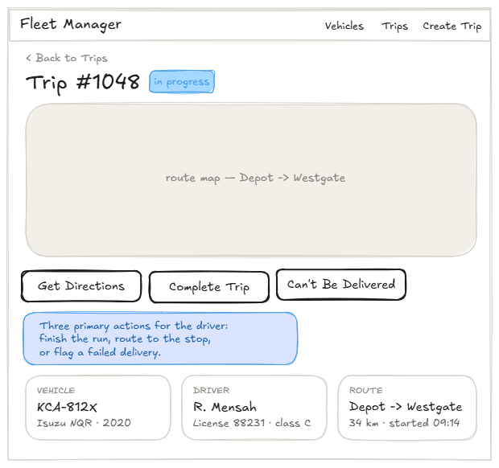
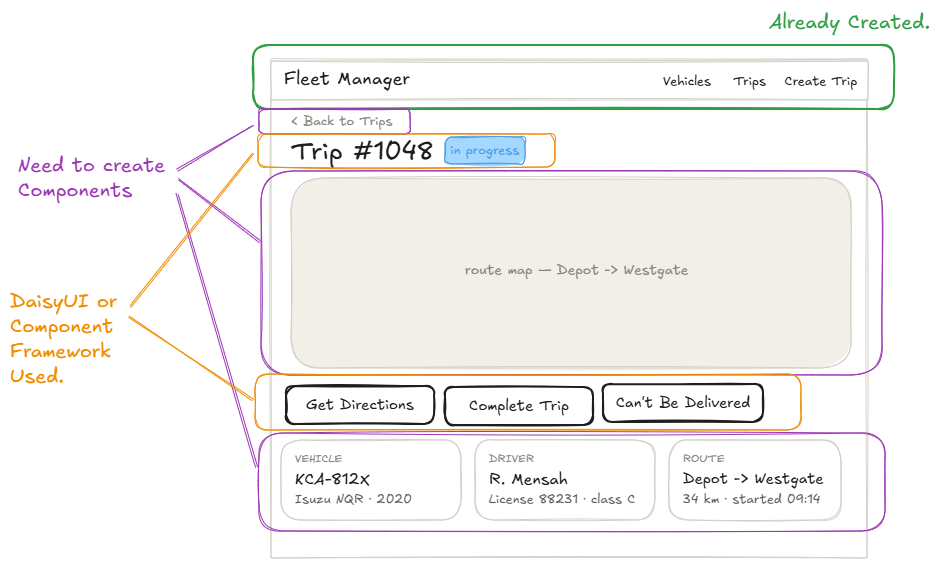

# Building Full-Stack Features from UI Mockups

This example walks through a professional frontend development workflow: starting from a UI mockup, breaking it down into components, building those components with mock data first, and then connecting them to a real backend API. The feature we are building is a Trip Detail page for the Fleet Manager app.

## Prerequisites

### Backend
- Create a virtual environment inside `vehiclefleet_backend/` and install packages from `requirements.txt`.
- Run `python manage.py migrate` to apply migrations.
- Run `python manage.py loaddata vehicles drivers trips` to load the base sample data.
- Run `python manage.py runserver`.

### Frontend
- Run `npm install` inside `vehiclefleet_frontend/`.
- Run `npm run dev`.

---

## The Workflow: Mockup → Components → Mock Data → Real Data

Before writing any code, we start with a UI mockup. A mockup lets you identify what needs to be built, agree on the design with stakeholders, and plan the work — all before touching a single file.

The workflow for building a full-stack feature from a mockup follows these four steps:

**1. Design the mockup first (given to you, work with a design team to do this, or do it yourself)**

Create the UI mockup before writing any code. A mockup forces you to think through the layout, the data you need, and the interactions — all without getting distracted by implementation details. It also gives you something concrete to discuss with your team or stakeholders before committing to an approach.

**2. Analyze the mockup and break it down into components**

Look at the mockup and identify which pieces are already built, which need to be created, and which the component library handles for you. The annotated mockup below uses colour to make this explicit:





- **Green** — Components already built in a previous example (the navbar). No work needed.
- **Purple** — New components we need to create to satisfy the mockup requirements:
  - A **map component** that will show the route of the trip.
  - A **back button component** that navigates back to the trips list.
  - A **trip detail component** that displays vehicle, driver, distance, and route information passed as props.
- **Orange** — Elements that DaisyUI's component library covers directly (the trip heading with status badge, the action buttons row). These require minimal custom code.

This analysis gives you a clear work list before you open a single file.

**3. Build the components with mock data first**

Create all the new components and the new Trip Detail page, but wire them to static data from `mockData.js` instead of the API. This lets you focus entirely on the frontend — layout, styling, conditional rendering — without needing the backend to be running. When the components look right against mock data, you know the structure is correct before adding network complexity.

**4. Identify the backend data needs, then connect to the real API**

Look at everything the mockup needs to display and confirm the backend can provide it. In this example the `/api/v1/trips/{id}/map/` endpoint from the previous example already returns the trip details, coordinates, and status we need — so no new backend work is required beyond confirming what exists. Then add the API fetch functions and React Query hooks, and swap the mock data import in the page for the real hook. The components themselves don't change — only the data source does.

---

## Steps

---

### 1. Add `src/mockData.js` with sample trip data

Before connecting to the backend we need realistic data to develop against. A `mockData.js` file exports static objects that mirror the shape of the API response so every component can be built and tested in isolation.

```js
// src/mockData.js

export const VEHICLES = [
  { id: 1, make: "Ford",     model: "Transit",  year: 2022, license_plate: "ABC-1234" },
  { id: 2, make: "Toyota",   model: "HiAce",    year: 2021, license_plate: "XYZ-5678" },
  { id: 3, make: "Mercedes", model: "Sprinter", year: 2020, license_plate: "DEF-9012" },
]

export const DRIVERS = [
  { id: 1, name: "Jane Smith",   license_number: "DL-99887", phone: "555-0100", email: "jane@example.com"  },
  { id: 2, name: "Bob Johnson",  license_number: "DL-44521", phone: "555-0200", email: "bob@example.com"   },
  { id: 3, name: "Maria Garcia", license_number: "DL-77634", phone: "555-0300", email: "maria@example.com" },
]

export const TRIPS = [
  { id: 1, vehicle_detail: VEHICLES[0], driver_detail: DRIVERS[0], start_location: "Warehouse A",        end_location: "Downtown Depot",            start_time: "2026-05-01T08:00:00Z", end_time: "2026-05-01T09:30:00Z", distance: "45.20" },
  { id: 2, vehicle_detail: VEHICLES[1], driver_detail: DRIVERS[1], start_location: "City Hub",           end_location: "Airport Terminal B",        start_time: "2026-05-02T07:00:00Z", end_time: "2026-05-02T08:15:00Z", distance: "32.80" },
  { id: 3, vehicle_detail: VEHICLES[2], driver_detail: DRIVERS[2], start_location: "North Yard",         end_location: "South Distribution Centre", start_time: "2026-05-03T06:30:00Z", end_time: "2026-05-03T08:45:00Z", distance: "78.50" },
  { id: 4, vehicle_detail: VEHICLES[0], driver_detail: DRIVERS[1], start_location: "Downtown Depot",     end_location: "Warehouse B",               start_time: "2026-05-04T10:00:00Z", end_time: "2026-05-04T11:10:00Z", distance: "28.60" },
  { id: 5, vehicle_detail: VEHICLES[1], driver_detail: DRIVERS[0], start_location: "Airport Terminal B", end_location: "City Hub",                  start_time: "2026-05-05T14:00:00Z", end_time: null,                   distance: null    },
]
```

Let's talk about what this is doing.
- Exporting constants (all-caps names) signals that these are static fixtures, not live state.
- Each `TRIPS` entry nests the full vehicle and driver objects under `vehicle_detail` and `driver_detail` — matching the shape the `TripSerializer` returns from the backend so swapping in real data later requires no changes to component code.
- Trip 5 has `end_time: null` and `distance: null` to simulate an in-progress trip, letting us test conditional rendering now rather than discovering it only after connecting to the API.

---

### 2. Create `src/components/BackButton.jsx`

The Back button is a simple navigation link that takes the user back to the trips list. It belongs in its own component because it can be reused on any detail page.

```jsx
// src/components/BackButton.jsx

import { Link } from 'react-router-dom'

function BackButton({ to, label }) {
  return (
    <Link to={to} className="text-sm text-base-content/60 hover:text-base-content flex items-center gap-1 mb-2">
      &lt; {label}
    </Link>
  )
}

export default BackButton
```

Let's talk about what this code is doing.
- `Link` from React Router renders an `<a>` tag that navigates without a full page reload. Using `Link` instead of a plain `<a href>` keeps the app in SPA mode.
- `to` and `label` are props so the button is reusable — the same component works for "Back to Trips", "Back to Vehicles", or any other detail page.
- The `&lt;` entity renders the `<` character safely inside JSX.

---

### 3. Create `src/components/TripMap.jsx`

The map panel shows the route label and a placeholder area where a real interactive map will eventually live. Building it now with static text keeps the layout accurate while deferring the mapping library integration to a later step.

```jsx
// src/components/TripMap.jsx

function TripMap({ startLocation, endLocation }) {
  return (
    <div className="card bg-base-200 shadow-sm">
      <div className="card-body items-center justify-center min-h-48 text-base-content/40 text-sm">
        route map — {startLocation} → {endLocation}
      </div>
    </div>
  )
}

export default TripMap
```

Let's talk about what this code is doing.
- The component only receives `startLocation` and `endLocation` as props. It knows nothing about trip IDs, coordinates, or the API — keeping it focused on display only.
- `min-h-48` gives the card a fixed minimum height so the layout looks correct even before real map tiles are added.
- `text-base-content/40` renders the placeholder text at 40% opacity — a visual convention for placeholder content.
- This is intentionally a placeholder — in step 14 we will replace the placeholder with a real Leaflet map once coordinates are available from the backend.

---

### 4. Create `src/components/TripCard.jsx`

Each of the three info panels in the mockup (Vehicle, Driver, Route) shares the same visual structure: a small uppercase label, a bold title, and a muted subtitle line. Rather than repeating that markup three times, we extract it into a single reusable `TripCard` component.

```jsx
// src/components/TripCard.jsx

function TripCard({ label, title, subtitle }) {
  return (
    <div className="card bg-base-100 shadow-sm">
      <div className="card-body gap-1">
        <p className="text-xs font-semibold uppercase tracking-widest opacity-50">{label}</p>
        <p className="text-lg font-bold">{title}</p>
        <p className="text-sm opacity-60">{subtitle}</p>
      </div>
    </div>
  )
}

export default TripCard
```

Let's talk about what this code is doing.
- `TripCard` accepts three string props — `label`, `title`, `subtitle` — and knows nothing about trips, vehicles, or drivers. This is the key to reusability: the component only knows how to render a labelled card, not what data goes into it.
- Because all three info cards share the same DaisyUI markup, any future styling change (e.g. adding a border or a hover effect) only needs to happen in one place.
- This component can be used anywhere in the app that needs to display a labelled piece of information in card format — not just on the Trip Detail page.

---

### 5. Create `src/components/TripInfo.jsx`

`TripInfo` receives the full trip object as a prop, derives the three strings each `TripCard` needs, and renders them in a grid.

```jsx
// src/components/TripInfo.jsx

import TripCard from './TripCard'

function TripInfo({ trip }) {
  const { vehicle_detail, driver_detail, start_location, end_location, start_time, distance } = trip

  const startFormatted = new Date(start_time).toLocaleTimeString([], { hour: '2-digit', minute: '2-digit' })

  return (
    <div className="grid grid-cols-1 sm:grid-cols-3 gap-4">
      <TripCard
        label="Vehicle"
        title={vehicle_detail.license_plate}
        subtitle={`${vehicle_detail.make} ${vehicle_detail.model} · ${vehicle_detail.year}`}
      />
      <TripCard
        label="Driver"
        title={driver_detail.name}
        subtitle={`License ${driver_detail.license_number}`}
      />
      <TripCard
        label="Route"
        title={`${start_location} → ${end_location}`}
        subtitle={`${distance ? `${distance} km` : 'In progress'} · started ${startFormatted}`}
      />
    </div>
  )
}

export default TripInfo
```

Let's talk about what this code is doing.
- `TripInfo` is the only component that knows about trip data. It handles all the data shaping — formatting the time, building the route string, handling null distance — then passes clean strings down to `TripCard`.
- Destructuring `trip` at the top keeps the JSX readable — we reference `vehicle_detail` rather than `trip.vehicle_detail` throughout.
- `toLocaleTimeString` formats the ISO timestamp into a short `HH:MM` string for the "started 09:14" label the mockup shows.
- `distance ? ...` handles the in-progress case (`null` distance) without a separate loading branch — a single ternary covers both states.
- The three `TripCard` components sit inside a CSS grid. On small screens they stack vertically; on `sm` and above they sit side by side, matching the mockup layout.
- The division of responsibilities here is deliberate: `TripCard` knows how to *display* a card; `TripInfo` knows how to *prepare* trip data for display. Neither mixes the other's concern.

---

### 6. Create `src/pages/TripDetailPage.jsx` using mock data

With the three components ready, we assemble the full page. At this stage we hardcode a single trip from `TRIPS` so we can see the page rendered correctly without touching the backend.

```jsx
// src/pages/TripDetailPage.jsx

import BackButton from '../components/BackButton'
import TripMap from '../components/TripMap'
import TripInfo from '../components/TripInfo'
import { TRIPS } from '../mockData'

const MOCK_TRIP = TRIPS[0]

function TripDetailPage() {
  const trip = MOCK_TRIP
  const isInProgress = trip.end_time === null

  return (
    <div className="flex flex-col gap-6">
      <div>
        <BackButton to="/trips" label="Back to Trips" />
        <div className="flex items-center gap-3">
          <h1 className="text-3xl font-bold">Trip #{trip.id}</h1>
          {isInProgress && (
            <span className="badge badge-info">in progress</span>
          )}
        </div>
      </div>

      <TripMap startLocation={trip.start_location} endLocation={trip.end_location} />

      <div className="flex flex-wrap gap-2">
        <button className="btn btn-outline">Get Directions</button>
        <button className="btn btn-outline">Complete Trip</button>
        <button className="btn btn-outline btn-error">Can't Be Delivered</button>
      </div>

      <TripInfo trip={trip} />
    </div>
  )
}

export default TripDetailPage
```

Let's talk about what this code is doing.
- Importing from `mockData` instead of a hook means this page works immediately with zero network requests — exactly the goal of the mock-first phase.
- `MOCK_TRIP` is declared outside the component so it is not re-created on every render.
- `isInProgress` derives from the data rather than being hardcoded, so the badge renders correctly for any mock trip we swap in.
- The three action buttons are DaisyUI `btn` components — they match the orange "component library" elements from the mockup but have no handlers yet.

---

### 7. Add the `/trips/:id` route and a link from `TripList`

For the page to be reachable we need to register its route in `App.jsx` and add a clickable entry point in `TripList`.

#### 6a. Register the route in `src/App.jsx`

```jsx
// src/App.jsx
import TripDetailPage from './pages/TripDetailPage'

// inside <Routes>:
<Route path="/trips/:id" element={<TripDetailPage />} />
```

#### 6b. Add a link to each row in `src/components/TripList.jsx`

```jsx
// src/components/TripList.jsx
import { Link } from 'react-router-dom'

// inside the <tr> for each trip, add a final cell:
<td>
  <Link to={`/trips/${trip.id}`} className="btn btn-xs btn-ghost">View</Link>
</td>
```

And add a matching `<th>` header cell so the column aligns.

Let's talk about what this code is doing.
- `:id` in the route path is a URL parameter. React Router captures whatever segment appears there and makes it available as `params.id` via the `useParams` hook in the page component.
- The `Link` in `TripList` builds the URL dynamically using the trip's `id`. Clicking "View" on trip 3 navigates to `/trips/3`.
- At this point the page always shows the same mock trip regardless of which row was clicked — that is intentional. We verify the layout is correct before wiring up real data.

---

### 8. Identify the backend data needed

Looking at the mockup, the Trip Detail page needs:
- Trip ID and status (pending / in progress / completed / failed)
- Vehicle: license plate, make, model, year
- Driver: name, license number
- Route: start location, end location, distance, start time
- Coordinates for the map: `start_lat`, `start_lng`, `end_lat`, `end_lng`

The `/api/v1/trips/{id}/map/` endpoint from the previous example covers most of this, but the buttons ("Start Trip", "Complete Trip") require two new POST endpoints that transition the trip's status. We also need to add an explicit `status` field to the model.

---

### 9. Add a `status` field to `fleet/models.py` and create the migration

```python
# fleet/models.py

class Trip(models.Model):
    STATUS_PENDING = "pending"
    STATUS_IN_PROGRESS = "in_progress"
    STATUS_COMPLETED = "completed"
    STATUS_FAILED = "failed"
    STATUS_CHOICES = [
        (STATUS_PENDING, "Pending"),
        (STATUS_IN_PROGRESS, "In Progress"),
        (STATUS_COMPLETED, "Completed"),
        (STATUS_FAILED, "Failed"),
    ]

    # ... existing fields ...
    status = models.CharField(max_length=20, choices=STATUS_CHOICES, default=STATUS_PENDING)
    # ... remaining fields ...
```

Then add `"status"` to the `fields` list in `TripSerializer` and create the migration:

```bash
python manage.py makemigrations
python manage.py migrate
```

Let's talk about what this code is doing.
- The four status constants are defined directly on the model class (`Trip.STATUS_PENDING`, etc.) — this avoids magic strings in views and tests and makes the valid values discoverable from the model.
- `default=STATUS_PENDING` means every trip starts as pending. Existing trips in the database receive `"pending"` automatically when the migration runs.
- Storing status explicitly rather than deriving it from `end_time is None` is clearer, more extensible (adding a `"failed"` state), and easier to filter on in queries.
- Adding `"status"` to `TripSerializer.fields` exposes it in every API response so the frontend always knows the current state.

---

### 10. Add `start` and `complete` actions to `TripViewSet` in `fleet/views.py`

```python
# fleet/views.py

class TripViewSet(ModelViewSet):
    # ... existing code ...

    @action(detail=True, methods=["post"])
    def start(self, request, pk=None):
        trip = self.get_object()
        trip.status = Trip.STATUS_IN_PROGRESS
        trip.save(update_fields=["status"])
        return Response(self.get_serializer(trip).data)

    @action(detail=True, methods=["post"])
    def complete(self, request, pk=None):
        trip = self.get_object()
        trip.status = Trip.STATUS_COMPLETED
        trip.end_time = timezone.now()
        trip.save(update_fields=["status", "end_time"])
        return Response(self.get_serializer(trip).data)
```

These register two new endpoints:
- `POST /api/v1/trips/{id}/start/`
- `POST /api/v1/trips/{id}/complete/`

Let's talk about what this code is doing.
- Both actions use `methods=["post"]` — status transitions are state-changing operations, so GET is the wrong verb. POST makes it clear the client is requesting a server-side action, not just reading data.
- `self.get_object()` fetches the trip and applies any permission checks, exactly like `retrieve` does — we get the safety of DRF's object-level permissions for free.
- `update_fields=["status"]` and `update_fields=["status", "end_time"]` write only the changed columns, keeping the save efficient and avoiding overwriting unrelated fields.
- `complete` also sets `end_time = timezone.now()` so the timestamp of completion is recorded. Using `timezone.now()` rather than `datetime.now()` keeps the value timezone-aware, consistent with Django's `USE_TZ = True` setting.
- Both actions return the full serialized trip so the frontend can update its local cache with a single response — no second GET needed.

---

### 11. Add `fetchTripMap`, `fetchStartTrip`, and `fetchCompleteTrip` to `src/api/fleet.js`

```js
// src/api/fleet.js

export async function fetchTripMap(id) {
  const response = await fetch(`${BASE_URL}/trips/${id}/map/`)
  if (!response.ok) throw new Error('Failed to fetch trip map data')
  return response.json()
}

export async function fetchStartTrip(id) {
  const response = await fetch(`${BASE_URL}/trips/${id}/start/`, { method: 'POST' })
  if (!response.ok) throw new Error('Failed to start trip')
  return response.json()
}

export async function fetchCompleteTrip(id) {
  const response = await fetch(`${BASE_URL}/trips/${id}/complete/`, { method: 'POST' })
  if (!response.ok) throw new Error('Failed to complete trip')
  return response.json()
}
```

Let's talk about what this code is doing.
- `fetchStartTrip` and `fetchCompleteTrip` pass `method: 'POST'` in the fetch options — the backend `@action` endpoints only accept POST, so sending GET would return a 405 Method Not Allowed error.
- No request body is needed for these transitions; the server derives everything from the trip's primary key in the URL.
- All three functions follow the same fetch-then-check-then-parse pattern, making them easy to test and swap out.

---

### 12. Update `src/hooks/useTripDetails.js` to include `startTrip` and `completeTrip` mutations

```js
// src/hooks/useTripDetails.js

import { useQuery, useMutation, useQueryClient } from '@tanstack/react-query'
import { fetchTripMap, fetchStartTrip, fetchCompleteTrip } from '../api/fleet'

export function useTripDetails(id) {
  const queryClient = useQueryClient()

  const { data: trip, isLoading, isError, error } = useQuery({
    queryKey: ['trip-map', id],
    queryFn: () => fetchTripMap(id),
    enabled: !!id,
  })

  const startTrip = useMutation({
    mutationFn: () => fetchStartTrip(id),
    onSuccess: () => queryClient.invalidateQueries({ queryKey: ['trip-map', id] }),
  })

  const completeTrip = useMutation({
    mutationFn: () => fetchCompleteTrip(id),
    onSuccess: () => queryClient.invalidateQueries({ queryKey: ['trip-map', id] }),
  })

  return { trip, isLoading, isError, error, startTrip, completeTrip }
}
```

Let's talk about what this code is doing.
- `useMutation` is React Query's tool for operations that change server state — the equivalent of `useQuery` but for write operations. It exposes `.mutate()` to trigger the call and `.isPending` to track whether a request is in flight.
- `onSuccess: () => queryClient.invalidateQueries(...)` marks the cached trip as stale after a successful status change. React Query then re-fetches `/trips/{id}/map/` in the background, so the page reflects the new status without a manual reload.
- Both mutations close over `id` from the outer function scope — the same `id` that drives the query. This ensures the mutation always targets the trip currently displayed on the page.
- Returning `startTrip` and `completeTrip` as objects (not just `.mutate` functions) lets the page component access `.isPending` to disable buttons and show a spinner while the request is in flight.

---

### 13. Connect `TripDetailPage` to real data with status badge and wired buttons

```jsx
// src/pages/TripDetailPage.jsx

import { useParams } from 'react-router-dom'
import BackButton from '../components/BackButton'
import TripMap from '../components/TripMap'
import TripInfo from '../components/TripInfo'
import { useTripDetails } from '../hooks/useTripDetails'

const STATUS_BADGE = {
  pending: 'badge-ghost',
  in_progress: 'badge-info',
  completed: 'badge-success',
  failed: 'badge-error',
}

const STATUS_LABEL = {
  pending: 'Pending',
  in_progress: 'In Progress',
  completed: 'Completed',
  failed: 'Failed',
}

function TripDetailPage() {
  const { id } = useParams()
  const { trip, isLoading, isError, startTrip, completeTrip } = useTripDetails(id)

  if (isLoading) return <span className="loading loading-spinner loading-lg" />
  if (isError || !trip) return <p className="text-error">Trip not found.</p>

  return (
    <div className="flex flex-col gap-6">
      <div>
        <BackButton to="/trips" label="Back to Trips" />
        <div className="flex items-center gap-3">
          <h1 className="text-3xl font-bold">Trip #{trip.id}</h1>
          <span className={`badge ${STATUS_BADGE[trip.status] ?? 'badge-ghost'}`}>
            {STATUS_LABEL[trip.status] ?? trip.status}
          </span>
        </div>
      </div>

      <TripMap startLocation={trip.start_location} endLocation={trip.end_location} />

      <div className="flex flex-wrap gap-2">
        {trip.status === 'pending' && (
          <button
            className="btn btn-primary"
            onClick={() => startTrip.mutate()}
            disabled={startTrip.isPending}
          >
            {startTrip.isPending
              ? <span className="loading loading-spinner loading-sm" />
              : 'Start Trip'
            }
          </button>
        )}
        {trip.status === 'in_progress' && (
          <>
            <button
              className="btn btn-outline"
              onClick={() => completeTrip.mutate()}
              disabled={completeTrip.isPending}
            >
              {completeTrip.isPending
                ? <span className="loading loading-spinner loading-sm" />
                : 'Complete Trip'
              }
            </button>
            <button className="btn btn-outline btn-error">Can't Be Delivered</button>
          </>
        )}
      </div>

      <TripInfo trip={trip} />
    </div>
  )
}

export default TripDetailPage
```

Let's talk about what this code is doing.
- `STATUS_BADGE` and `STATUS_LABEL` are lookup objects defined outside the component. Mapping a status string to a DaisyUI class and a display label in one place means adding a new status later is a single-line change.
- `STATUS_BADGE[trip.status] ?? 'badge-ghost'` uses nullish coalescing as a safety net — if the backend ever returns an unexpected status value the badge still renders rather than crashing.
- Conditional rendering based on `trip.status` ensures the correct buttons are shown for each state: only "Start Trip" appears for a pending trip; only "Complete Trip" and "Can't Be Delivered" appear for an in-progress trip; completed and failed trips show no action buttons.
- `disabled={startTrip.isPending}` prevents double-clicks while the POST request is in flight.
- The inline ternary `startTrip.isPending ? <spinner /> : 'Start Trip'` gives immediate visual feedback — the button label turns into a spinner the moment the user clicks, without needing a separate loading state variable.
- `useParams()` reads the `:id` segment from the URL; `useTripDetails(id)` fetches the trip and exposes both the query result and the two mutations through a single import.

---

### 14. Replace the `TripMap` placeholder with a real Leaflet map (Optional)

Now that the backend provides `start_coordinates` and `end_coordinates`, we can render a real interactive map. Install `react-leaflet` (the React wrapper around the Leaflet mapping library):

```bash
npm install react-leaflet
```

> **react-leaflet docs:** https://react-leaflet.js.org/docs/start-installation
> **MapContainer API:** https://react-leaflet.js.org/docs/api-map
> **Polyline API:** https://react-leaflet.js.org/docs/api-components#polyline

Then update `TripMap` to render the map when coordinates are available and fall back to the placeholder when they are not.

A hardcoded `zoom` level can't adapt to different trip distances — a 10 km city run and a 500 km highway trip need completely different zoom levels to show the full route. The solution is a small `FitBounds` helper component that uses the `useMap` hook to call Leaflet's `fitBounds` method after the map mounts.

> **`useMap` hook docs:** https://react-leaflet.js.org/docs/example-view-bounds/

```jsx
// src/components/TripMap.jsx

import { useEffect } from 'react'
import { MapContainer, TileLayer, Polyline, useMap } from 'react-leaflet'
import 'leaflet/dist/leaflet.css'

function FitBounds({ positions }) {
  const map = useMap()
  useEffect(() => {
    map.fitBounds(positions, { padding: [50, 50] })
  }, [map, positions])
  return null
}

function TripMap({ startLocation, endLocation, startCoordinates, endCoordinates }) {
  if (!startCoordinates || !endCoordinates) {
    return (
      <div className="card bg-base-200 shadow-sm">
        <div className="card-body items-center justify-center min-h-48 text-base-content/40 text-sm">
          route map — {startLocation} → {endLocation}
        </div>
      </div>
    )
  }

  const positions = [
    [startCoordinates.lat, startCoordinates.lng],
    [endCoordinates.lat, endCoordinates.lng],
  ]
  const center = [
    (startCoordinates.lat + endCoordinates.lat) / 2,
    (startCoordinates.lng + endCoordinates.lng) / 2,
  ]

  return (
    <div className="rounded-box overflow-hidden shadow-sm" style={{ height: '300px' }}>
      <MapContainer center={center} zoom={7} style={{ height: '100%', width: '100%' }} scrollWheelZoom={false}>
        <TileLayer
          attribution='&copy; <a href="https://www.openstreetmap.org/copyright">OpenStreetMap</a> contributors'
          url="https://{s}.tile.openstreetmap.org/{z}/{x}/{y}.png"
        />
        <Polyline
          positions={positions}
          pathOptions={{ color: '#570df8', dashArray: '10, 8', weight: 3 }}
        />
        <FitBounds positions={positions} />
      </MapContainer>
    </div>
  )
}

export default TripMap
```

Also update `TripDetailPage` to pass the coordinate props:

```jsx
// src/pages/TripDetailPage.jsx

<TripMap
  startLocation={trip.start_location}
  endLocation={trip.end_location}
  startCoordinates={trip.start_coordinates}
  endCoordinates={trip.end_coordinates}
/>
```

Let's talk about what this code is doing.
- `react-leaflet` provides React components (`MapContainer`, `TileLayer`, `Polyline`) that wrap the Leaflet JS library. Leaflet itself handles all the map rendering; `react-leaflet` just wires it into React's component tree.
- `import 'leaflet/dist/leaflet.css'` is required — without it the map tiles and controls render in the wrong positions.
- The `!startCoordinates || !endCoordinates` guard means the component gracefully falls back to the placeholder text when coordinates have not yet been geocoded. This keeps the component safe during the mock-data phase and for trips that haven't called the `/map/` endpoint yet.
- `useMap()` is a react-leaflet hook that returns the Leaflet `map` instance. It can only be called from inside a component that is a *descendant* of `MapContainer` — that is why `FitBounds` must be a child component rather than code in `TripMap` itself.
- `map.fitBounds(positions, { padding: [50, 50] })` tells Leaflet to zoom and pan the map so that both coordinates fit within the viewport, with 50px of padding on each side so the endpoints aren't clipped at the edge.
- Wrapping the `fitBounds` call in `useEffect` ensures it runs after the map has mounted and is ready. Calling it during render would attempt to interact with a map that hasn't initialised yet.
- `FitBounds` returns `null` — it is a behaviour-only component with no visual output. This is a common react-leaflet pattern: a lightweight child component whose only job is to interact with the map instance.
- `center` and `zoom` are still required by `MapContainer` for the initial render. `FitBounds` overrides them immediately after mount, so their exact values don't matter as long as they are valid.
- `scrollWheelZoom={false}` disables zooming with the mouse wheel — a small UX improvement that prevents the map from accidentally capturing scroll events when the user is scrolling the page.
- `TileLayer` loads the map tiles from OpenStreetMap. The `attribution` prop is required by OpenStreetMap's terms of use.
- `Polyline` draws the route. `positions` is an array of `[lat, lng]` pairs — just the two endpoints for now.
- `pathOptions={{ color: '#570df8', dashArray: '10, 8', weight: 3 }}` styles the line: `color` uses the DaisyUI primary purple, `dashArray: '10, 8'` creates a dashed pattern (10px dash, 8px gap), and `weight: 3` sets the line thickness in pixels.
- `rounded-box overflow-hidden` on the wrapper clips the map tiles to the card's rounded corners — without `overflow-hidden` the map tiles bleed outside the border radius.

---

## Challenge/Exercise

### 1. Add a status badge to `TripList`

The trips table currently shows "In progress" as plain text in the Distance column. Replace it with a proper DaisyUI badge that uses the same `STATUS_BADGE` colour mapping introduced on the detail page.

### 2. Add start and end markers to the map

The route currently shows a dashed line but no markers at either end. Add a `Marker` component from react-leaflet at each position so users can clearly see where the trip starts and ends. You will need to fix the default Leaflet icon path issue that occurs with Vite — search for "leaflet marker icon vite" for the standard fix.

### 3. Add the "Can't Be Delivered" flow

Make the "Can't Be Delivered" button functional by adding a `fetchFailTrip` API function, a `useMutation` hook in `useTripDetails`, and a `POST /trips/{id}/fail/` action on the backend that sets `status = "failed"` and `end_time = timezone.now()`. Update the page to show the "Failed" badge and hide action buttons when a trip is marked as failed.

---

## Conclusion

In this example we practiced a structured approach for building full-stack features from a UI mockup:

- **Mockup analysis before coding** — identifying which components already exist (green), which need to be built (purple), and which the component library covers (orange) gives a clear work plan before any files are opened
- **Mock data first** — exporting static fixtures from `mockData.js` that mirror the API response shape lets you build and style every component without a running backend, and makes the switch to real data a one-line change
- **One component, one responsibility** — `BackButton` navigates, `TripMap` displays the route, `TripCard` renders a single labelled info card, `TripInfo` assembles trip data into three `TripCard` instances; none of them fetch data or know about the API
- **Extract repeated markup into a reusable primitive** — `TripCard` exists because Vehicle, Driver, and Route all share the same label/title/subtitle structure; any future styling change only needs to happen in one file, and the component can be dropped into any other page that needs the same card pattern
- **Props over coupling** — passing `trip` as a prop to `TripInfo` (rather than calling a hook inside it) keeps the component reusable and easy to test with mock data
- **`enabled: !!id` guard** — React Query's `enabled` option prevents a query from firing when its key is not yet available; always use it when the query key depends on a URL parameter
- **`queryKey` includes the ID** — scoping the cache key to `['trip-map', id]` ensures each trip gets its own cache entry; without the ID, every detail page would share the same cached result
- **The mock-first → real-data transition is mechanical** — once all components are built against mock data, connecting to the backend is just swapping `import { TRIPS } from '../mockData'` for `useTripDetails(id)` in the page; the components themselves do not change
- **Explicit status field over derived state** — storing `status` as a database column (rather than deriving it from `end_time is None`) is clearer, easier to filter on, and extensible to new states like `"failed"` without touching the schema again
- **`@action` + `methods=["post"]` for state transitions** — DRF custom actions are the right tool for operations that don't map cleanly to CRUD; `POST /trips/{id}/start/` is more expressive than `PATCH /trips/{id}/` with a `{"status": "in_progress"}` body
- **`useMutation` + `onSuccess` invalidation** — after a mutation succeeds, calling `invalidateQueries` on the relevant cache key triggers a background re-fetch so the UI reflects the new server state without a page reload
- **`isPending` for in-flight feedback** — disabling the button and swapping its label for a spinner while `mutation.isPending` is true prevents double-submissions and gives the user immediate visual feedback that their click was registered
- **Conditional button rendering by status** — rendering action buttons based on `trip.status` means the UI always shows only the valid next actions; a completed trip shows nothing, a pending trip shows "Start Trip", an in-progress trip shows "Complete Trip"
- **Placeholder → real component upgrade** — building `TripMap` as a placeholder first lets the page layout be verified with no dependencies; upgrading it to a real Leaflet map in a later step is a self-contained change that doesn't touch any other component
- **Guard before rendering third-party components** — the `!startCoordinates || !endCoordinates` check keeps the component safe when coordinates are unavailable; always guard before passing data to a mapping library that will throw if given `null`
- **`import 'leaflet/dist/leaflet.css'` is mandatory** — Leaflet's CSS positions the map controls and tiles; omitting it produces a broken-looking map even though the JS works fine
- **`useMap` requires a descendant component** — react-leaflet's `useMap()` hook only works inside a component that is a child of `MapContainer`; wrapping the `fitBounds` call in a small `FitBounds` component is the standard pattern for any code that needs to interact with the Leaflet map instance
- **`fitBounds` inside `useEffect`** — the map must be mounted before `fitBounds` can be called; a `useEffect` guarantees the call happens after the component has rendered and the map is ready
