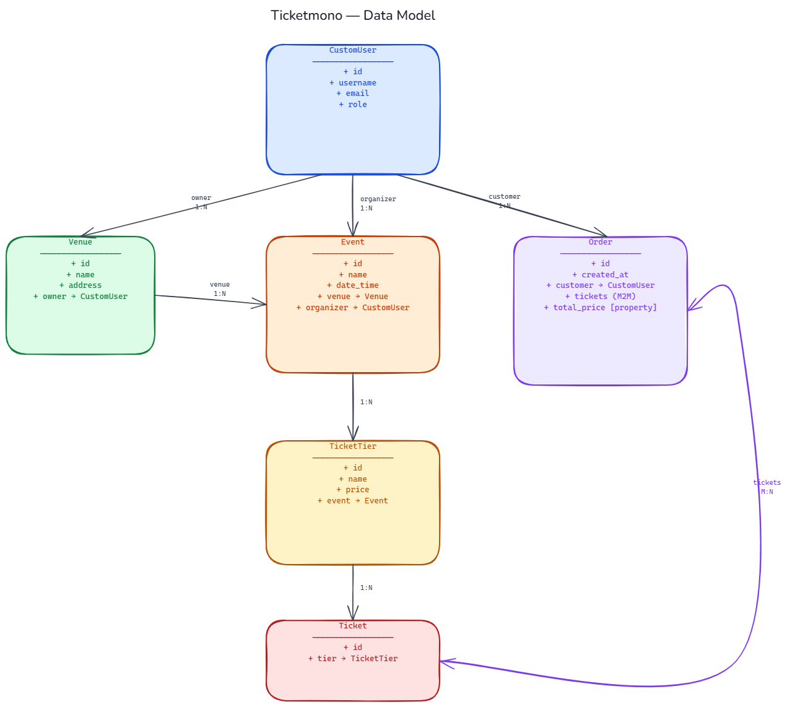
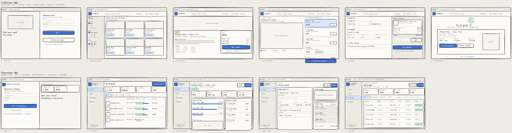
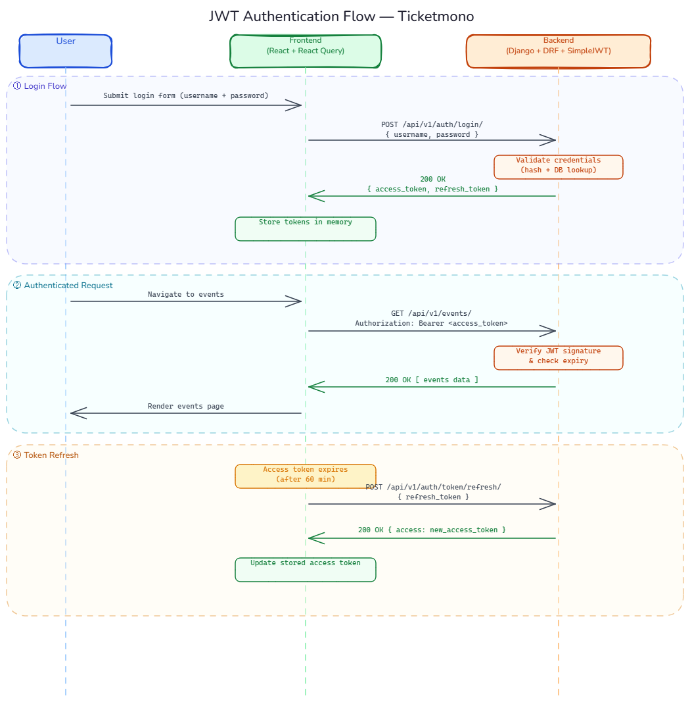

# Global State Management and API Integration — Ticketmono

Throughout the rest of the course we're going to build out a ticketing app called Ticketmono.

We're first going to discuss the architecture of the application and then we're going to build out the application using best practices piece by piece while reinforcing and introducing new concepts along the way. First we'll build out the user/attendee side of the application and later on we'll build out the event organizer side of the application.

In this example after we discuss the architecture, we're going to implement the authentication system using JWTs on the backend and then we're going to integrate this with the frontend and manage the authentication state in the frontend using all the concepts we've learned so far. We'll also be reusing a few components from previous examples.

## Prerequisites

### Backend
- Create a virtual environment inside `ticketmono_backend/` and install packages from `requirements.txt`.
- Run `python manage.py migrate` to apply migrations.
- Run `python manage.py runserver`.

### Frontend
- Run `npm install` inside `ticketmono_frontend/`.
- Run `npm run dev`.

---

## Architecture

This section explains the structure of the application before any implementation steps begin. Reading this first will help you understand *why* things are organised the way they are and how the backend and frontend fit together.

### Backend

The backend is a Django REST Framework project called `ticketmono_backend`. It has two apps:

**`core`** — owns the custom user model.

- `CustomUser` extends Django's `AbstractUser` and adds a `role` field (`user` or `event_organizer`). Setting `AUTH_USER_MODEL = "core.CustomUser"` in `settings.py` replaces the default auth model across the entire project. Any `ForeignKey` to the user model uses `settings.AUTH_USER_MODEL` rather than `"auth.User"` so it stays compatible if the model ever changes.

**`event_tickets`** — owns the domain models.

- `Venue` — a physical location with a name and address, owned by a `CustomUser` with the `event_organizer` role.
- `Event` — a named event at a `Venue` on a specific `date_time`, organised by a `CustomUser`.
- `TicketTier` — a pricing tier for an `Event` (e.g. General Admission, VIP). Each tier has a name and a price.
- `Ticket` — a single seat at a specific `TicketTier`. Creating a ticket reserves one seat; the tier it belongs to determines its price.
- `Order` — a collection of `Ticket` objects purchased by a `CustomUser`. The relationship to `Ticket` is `ManyToManyField` because one order can include multiple tickets. `total_price` is a computed `@property` that sums the price of each ticket's tier — it is not stored in the database.

The data model diagram below shows all six models and their relationships:



---

### Frontend

The frontend is a React + Vite application called `ticketmono_frontend`, using **Tailwind CSS v4** and **DaisyUI v5** for styling, **React Router v7** for navigation, and **TanStack React Query** for server state.

Pages are organised into two subfolders under `src/pages/`:

- **`src/pages/auth/`** — pages that are accessible without being logged in:
  - `LoginPage` → `/login`
  - `RegisterPage` → `/register`

- **`src/pages/attendee/`** — pages that make up the ticket-purchasing flow:
  - `EventsListPage` → `/` — browse all upcoming events
  - `EventDetailPage` → `/events/:id` — view a single event's details and available ticket tiers
  - `SelectTicketsPage` → `/events/:id/tickets` — choose how many tickets of each tier to add to an order
  - `CheckoutPage` → `/checkout` — review the order and confirm purchase

The user flow diagram below shows how a user moves through these pages:


The design mockups below show the intended UI for each page:



---

## Steps

### 0. Let's talk about how JWTs work.

JWTs (JSON Web Tokens) are a popular way to handle authentication in modern web applications, especially SPAs (Single Page Applications) where the frontend and backend are separate. The basic flow is shown in the following diagram:



### 1. Install `djangorestframework-simplejwt` and configure `ticketmono_backend/ticketmono_backend/settings.py`

SimpleJWT is the authentication backend. It issues short-lived access tokens (used on each API request) and long-lived refresh tokens (used to obtain a new access token without logging in again).

```
pip install djangorestframework-simplejwt
```
Then freeze the requirements to update `requirements.txt`:

```
pip freeze > requirements.txt
```

Then update `settings.py`:

```python
# ticketmono_backend/settings.py

from datetime import timedelta

INSTALLED_APPS = [
    # ... Django built-ins ...
    "rest_framework",
    "rest_framework_simplejwt",
    "corsheaders",
    "core",
    "event_tickets",
]

REST_FRAMEWORK = {
    "DEFAULT_AUTHENTICATION_CLASSES": (
        "rest_framework_simplejwt.authentication.JWTAuthentication",
    ),
}

SIMPLE_JWT = {
    "ACCESS_TOKEN_LIFETIME": timedelta(minutes=60),
    "REFRESH_TOKEN_LIFETIME": timedelta(days=7),
    "AUTH_HEADER_TYPES": ("Bearer",),
    "USER_ID_FIELD": "id",
    "USER_ID_CLAIM": "user_id",
}

CORS_ALLOWED_ORIGINS = [
    "http://localhost:5173",
]
```

Also add `CorsMiddleware` as the first entry in `MIDDLEWARE`:

```python
MIDDLEWARE = [
    "corsheaders.middleware.CorsMiddleware",
    "django.middleware.security.SecurityMiddleware",
    # ... rest unchanged ...
]
```

Let's talk about what this code is doing.
- `"rest_framework_simplejwt"` registers the package with Django so its views and authentication class are available.
- `"corsheaders"` and `CorsMiddleware` allow the React dev server (`localhost:5173`) to call the Django API without being blocked by the browser's same-origin policy. `CorsMiddleware` must appear before any middleware that generates responses, which is why it comes first.
- `"DEFAULT_AUTHENTICATION_CLASSES"` tells DRF to look for a `Bearer <token>` header on every request and validate it as a JWT. Views that require authentication return `401 Unauthorized` when the token is missing or expired.
- `ACCESS_TOKEN_LIFETIME: timedelta(minutes=60)` — the access token expires after 60 minutes. Short lifetimes limit the damage if a token is intercepted.
- `REFRESH_TOKEN_LIFETIME: timedelta(days=7)` — the refresh token lasts 7 days. The frontend exchanges it for a new access token before the access token expires, so the user stays logged in without re-entering their password.
- `AUTH_HEADER_TYPES: ("Bearer",)` — the frontend sends the token as `Authorization: Bearer <token>`. This is the OAuth 2.0 convention.
- `"event_tickets"` is added to `INSTALLED_APPS` here so Django picks up the app's models and migrations.

---

### 2. Create `core/serializers.py`

The registration serializer validates the incoming JSON and creates the user. The password field is `write_only` so it is accepted on input but never returned in a response.

```python
# core/serializers.py

from django.contrib.auth import get_user_model
from rest_framework import serializers

User = get_user_model()


class UserRegistrationSerializer(serializers.ModelSerializer):
    password = serializers.CharField(write_only=True, min_length=8)

    class Meta:
        model = User
        fields = ("username", "email", "password", "role")
        extra_kwargs = {
            "email": {"required": True},
            "role": {"required": False},
        }

    def create(self, validated_data):
        return User.objects.create_user(**validated_data)
```

Let's talk about what this code is doing.
- `get_user_model()` returns whatever model is set as `AUTH_USER_MODEL` — in this project that is `core.CustomUser`. Using `get_user_model()` rather than importing `CustomUser` directly is the correct pattern for code that needs to be compatible with a swappable user model.
- `write_only=True` on `password` means the field is accepted when deserialising (POST) but excluded when serialising (GET). A password hash should never appear in an API response.
- `min_length=8` adds a basic length check at the serializer layer before the data reaches the database.
- `create_user(**validated_data)` uses Django's built-in manager method which hashes the password before saving. Calling `User.objects.create(**validated_data)` instead would store the password as plain text.
- `role` is not required. Omitting it leaves the field at its default value (`"user"`), so ordinary registrations do not need to send a role.

---

### 3. Create `core/views.py`

Two views handle registration and the current user's profile. Token obtain and refresh are handled by SimpleJWT's built-in views (wired in the next step).

```python
# core/views.py

from rest_framework import status
from rest_framework.permissions import AllowAny, IsAuthenticated
from rest_framework.response import Response
from rest_framework.views import APIView

from core.serializers import UserRegistrationSerializer


class UserRegistrationView(APIView):
    permission_classes = (AllowAny,)

    def post(self, request):
        serializer = UserRegistrationSerializer(data=request.data)
        if serializer.is_valid():
            serializer.save()
            return Response(
                {"message": "User registered successfully."},
                status=status.HTTP_201_CREATED,
            )
        return Response(serializer.errors, status=status.HTTP_400_BAD_REQUEST)


class MeView(APIView):
    permission_classes = (IsAuthenticated,)

    def get(self, request):
        user = request.user
        return Response({
            "id": user.id,
            "username": user.username,
            "email": user.email,
            "role": user.role,
        })
```

Let's talk about what this code is doing.
- `permission_classes = (AllowAny,)` on `UserRegistrationView` allows unauthenticated requests. This is necessary — users cannot be logged in before they have an account.
- `serializer.is_valid()` runs all field-level and model-level validation. If it returns `False`, `serializer.errors` is a dict mapping field names to error messages — DRF returns it with a `400` so the client knows exactly what went wrong.
- `status.HTTP_201_CREATED` is more accurate than `200 OK` for a successful creation — it signals that a new resource was created rather than a general success.
- `permission_classes = (IsAuthenticated,)` on `MeView` means DRF will check the `Authorization: Bearer <token>` header and reject the request with `401` if it is missing or invalid. `request.user` is populated by `JWTAuthentication` when the token is valid.
- `MeView` returns the `role` field, which is specific to `CustomUser` and not available on Django's default user model. This is the endpoint the frontend calls after login to know which UI features to show.

---

### 4. Create `core/urls.py` and update `ticketmono_backend/urls.py`

Wire the views to URL paths. SimpleJWT's `TokenObtainPairView` handles login (returns access + refresh tokens) and `TokenRefreshView` handles token renewal.

```python
# core/urls.py

from django.urls import path
from rest_framework_simplejwt.views import TokenObtainPairView, TokenRefreshView

from core.views import MeView, UserRegistrationView

urlpatterns = [
    path("register/", UserRegistrationView.as_view(), name="auth-register"),
    path("login/", TokenObtainPairView.as_view(), name="auth-login"),
    path("token/refresh/", TokenRefreshView.as_view(), name="auth-token-refresh"),
    path("me/", MeView.as_view(), name="auth-me"),
]
```

```python
# ticketmono_backend/urls.py

from django.contrib import admin
from django.urls import include, path

urlpatterns = [
    path("admin/", admin.site.urls),
    path("api/v1/auth/", include("core.urls")),
]
```

Let's talk about what this code is doing.
- `TokenObtainPairView` is a built-in SimpleJWT view. It accepts `{ "username": "...", "password": "..." }` and returns `{ "access": "...", "refresh": "..." }` on success. No custom code needed.
- `TokenRefreshView` accepts `{ "refresh": "..." }` and returns a new `{ "access": "..." }`. The frontend calls this before the access token expires to silently re-authenticate the user.
- Grouping all auth paths under `api/v1/auth/` keeps them namespaced and separate from future domain endpoints (e.g. `api/v1/events/`).

The four auth endpoints are:

| Method | URL | Description |
|--------|-----|-------------|
| `POST` | `/api/v1/auth/register/` | Create a new user account |
| `POST` | `/api/v1/auth/login/` | Obtain access + refresh tokens |
| `POST` | `/api/v1/auth/token/refresh/` | Renew an expired access token |
| `GET`  | `/api/v1/auth/me/` | Return the current user's profile |

---

### 5. Test the authentication endpoints

Start the backend:

```
python manage.py runserver
```

**Register a new user**

```
POST http://localhost:8000/api/v1/auth/register/
Content-Type: application/json

{
  "username": "testuser",
  "email": "test@example.com",
  "password": "testpass123"
}
```

Expected response (`201 Created`):
```json
{ "message": "User registered successfully." }
```

**Log in and obtain tokens**

```
POST http://localhost:8000/api/v1/auth/login/
Content-Type: application/json

{
  "username": "testuser",
  "password": "testpass123"
}
```

Expected response (`200 OK`):
```json
{
  "access": "<access_token>",
  "refresh": "<refresh_token>"
}
```

**Fetch the current user's profile**

Copy the `access` value from the login response and set it as a Bearer token header:

```
GET http://localhost:8000/api/v1/auth/me/
Authorization: Bearer <access_token>
```

Expected response (`200 OK`):
```json
{
  "id": 1,
  "username": "testuser",
  "email": "test@example.com",
  "role": "user"
}
```

**Refresh the access token**

```
POST http://localhost:8000/api/v1/auth/token/refresh/
Content-Type: application/json

{
  "refresh": "<refresh_token>"
}
```

Expected response (`200 OK`):
```json
{ "access": "<new_access_token>" }
```

If the `me/` endpoint returns `401` without the `Authorization` header, authentication is working correctly — unauthenticated requests are rejected as expected.

---

### 6. Create `src/components/LoginForm.jsx`

The login form is a reusable component. It owns its own field state and delegates the actual submission logic to its parent page via an `onSubmit` prop — the component knows nothing about the API.

```jsx
// src/components/LoginForm.jsx

import { useState } from 'react'

function LoginForm({ onSubmit }) {
  const [username, setUsername] = useState('')
  const [password, setPassword] = useState('')

  function handleSubmit(e) {
    e.preventDefault()
    onSubmit({ username, password })
  }

  return (
    <form onSubmit={handleSubmit} className="flex flex-col gap-4">
      <div className="form-control">
        <label className="label">
          <span className="label-text">Username</span>
        </label>
        <input
          type="text"
          placeholder="Enter your username"
          className="input input-bordered w-full"
          value={username}
          onChange={(e) => setUsername(e.target.value)}
          required
        />
      </div>
      <div className="form-control">
        <label className="label">
          <span className="label-text">Password</span>
        </label>
        <input
          type="password"
          placeholder="Enter your password"
          className="input input-bordered w-full"
          value={password}
          onChange={(e) => setPassword(e.target.value)}
          required
        />
      </div>
      <button type="submit" className="btn btn-primary w-full mt-2">
        Log In
      </button>
    </form>
  )
}

export default LoginForm
```

Let's talk about what this code is doing.
- `useState` manages each field independently. The input is a **controlled component** — React is the source of truth for the field values, not the DOM.
- `e.preventDefault()` stops the browser from performing a full page reload on submit, which is the default form behaviour.
- `onSubmit({ username, password })` passes the collected values up to the parent. The form component has no knowledge of what happens next — it only collects and forwards.
- `type="password"` masks the password characters in the browser. `required` adds basic HTML5 validation before the form fires `onSubmit`.
- Keeping form state here (rather than in `LoginPage`) means the form can be reused anywhere without the parent having to manage individual field values.

---

### 7. Update `src/pages/auth/LoginPage.jsx` to use `LoginForm`

`LoginPage` provides the layout and will own the submission logic. For now `handleSubmit` logs to the console — the API call will be wired up in a later step.

```jsx
// src/pages/auth/LoginPage.jsx

import LoginForm from '../../components/LoginForm'

function LoginPage() {
  function handleSubmit(formData) {
    console.log('Login submitted:', formData)
  }

  return (
    <div className="flex justify-center mt-12">
      <div className="card bg-base-100 shadow w-full max-w-md">
        <div className="card-body">
          <h2 className="card-title text-2xl mb-2">Log In</h2>
          <LoginForm onSubmit={handleSubmit} />
        </div>
      </div>
    </div>
  )
}

export default LoginPage
```

Let's talk about what this code is doing.
- `LoginPage` is responsible for layout and submission behaviour; `LoginForm` is responsible for rendering fields and collecting values. This separation means the form markup never needs to change when we later replace `console.log` with an API call.
- The DaisyUI `card` centres the form on the page and gives it a visible container. `max-w-md` caps the width so the form does not stretch across a wide screen.
- `handleSubmit` receives `{ username, password }` from the form. In the next step this function will call the login API and store the returned tokens.

---

### 8. Create `src/api/tokenStorage.js`

Token storage helpers centralise every `localStorage` read and write behind named functions. Components and hooks never touch `localStorage` directly — they call these functions instead. If you ever want to change where tokens are stored (e.g. sessionStorage, an in-memory object), you only change this one file.

```js
// src/api/tokenStorage.js

const ACCESS_KEY = 'ticketmono_access'
const REFRESH_KEY = 'ticketmono_refresh'
const USER_ID_KEY = 'ticketmono_user_id'
const USERNAME_KEY = 'ticketmono_username'
const ROLE_KEY = 'ticketmono_role'

export function getAccessToken() { return localStorage.getItem(ACCESS_KEY) }
export function setAccessToken(token) { localStorage.setItem(ACCESS_KEY, token) }

export function getRefreshToken() { return localStorage.getItem(REFRESH_KEY) }
export function setRefreshToken(token) { localStorage.setItem(REFRESH_KEY, token) }

export function getStoredUser() {
  const id = localStorage.getItem(USER_ID_KEY)
  const username = localStorage.getItem(USERNAME_KEY)
  const role = localStorage.getItem(ROLE_KEY)
  return id && username ? { id: Number(id), username, role } : null
}

export function setStoredUser({ id, username, role }) {
  localStorage.setItem(USER_ID_KEY, String(id))
  localStorage.setItem(USERNAME_KEY, username)
  localStorage.setItem(ROLE_KEY, role)
}

export function clearStoredTokens() {
  localStorage.removeItem(ACCESS_KEY)
  localStorage.removeItem(REFRESH_KEY)
  localStorage.removeItem(USER_ID_KEY)
  localStorage.removeItem(USERNAME_KEY)
  localStorage.removeItem(ROLE_KEY)
}
```

Let's talk about what this code is doing.
- Five constants define the `localStorage` key names for this app. Prefixing every key with `ticketmono_` prevents collisions if another app is open on the same origin.
- `getStoredUser()` reconstructs the `{ id, username, role }` user object from three separate keys. It returns `null` if either `id` or `username` is missing — this covers the case where the user's data was never stored or was only partially cleared.
- `clearStoredTokens()` removes all five keys atomically. Calling this on logout means no stale credentials remain in the browser.

---

### 9. Create `src/api/client.js`

`apiClient` is a thin wrapper around `fetch` that automatically attaches the `Authorization` header and silently refreshes the token when a `401` response is received.

```js
// src/api/client.js

import { getAccessToken } from './tokenStorage'

// Fall back to the local Django dev server if the env variable is not set.
const BASE_URL = import.meta.env.VITE_API_URL ?? 'http://localhost:8000/api/v1'

// These are set once by AuthProvider after it mounts.
// The client itself has no React dependency — it just calls these callbacks
// when it needs to refresh a token or force a logout.
let _onTokenRefresh = null
let _onLogout = null

// If several requests fail with 401 at the same moment, we only want to
// call the refresh endpoint once. Storing the in-flight promise here means
// every waiting request shares the same result instead of each firing its own.
let _refreshPromise = null

// Called by AuthProvider so the client knows how to silently refresh tokens
// and how to log the user out when a refresh is no longer possible.
export function setAuthCallbacks({ onTokenRefresh, onLogout }) {
  _onTokenRefresh = onTokenRefresh
  _onLogout = onLogout
}

async function apiClient(endpoint, options = {}) {
  // Read the token at call time, not at module load time.
  // This ensures we always use the latest stored value, not a stale closure.
  const accessToken = getAccessToken()

  const headers = {
    'Content-Type': 'application/json',
    // Spread any headers the caller explicitly provided.
    ...options.headers,
    // Only attach the Authorization header if the user is actually logged in.
    // Anonymous requests (e.g. login, register) go through without a token.
    ...(accessToken ? { Authorization: `Bearer ${accessToken}` } : {}),
  }

  let res = await fetch(`${BASE_URL}${endpoint}`, { ...options, headers })

  // A 401 means the access token has expired. We only attempt a silent refresh
  // if both conditions are true:
  //   1. A refresh callback has been registered (AuthProvider is mounted).
  //   2. There is actually a token in storage — if there isn't, the 401 came
  //      from an anonymous request hitting a protected endpoint, which we
  //      should not silently retry.
  if (res.status === 401 && _onTokenRefresh && getAccessToken()) {
    try {
      // Deduplicate: if _refreshPromise already exists, another request got
      // here first and the refresh is already in flight. We await the same
      // promise so only one POST /auth/token/refresh/ is ever sent.
      if (!_refreshPromise) {
        _refreshPromise = _onTokenRefresh().finally(() => {
          // Clear the shared promise once the refresh settles so the next
          // expiry cycle can start fresh.
          _refreshPromise = null
        })
      }
      const newAccessToken = await _refreshPromise

      // Retry the original request with the new token.
      // We rebuild the headers object so the stale token is replaced.
      res = await fetch(`${BASE_URL}${endpoint}`, {
        ...options,
        headers: { ...headers, Authorization: `Bearer ${newAccessToken}` },
      })
    } catch {
      // The refresh itself failed (expired refresh token, network error, etc.).
      // Force a full logout so the user is sent back to the login page.
      _onLogout?.()
    }
  }

  // Always return the Response object. The caller decides whether to
  // check res.ok, parse JSON, or throw an error.
  return res
}

export default apiClient
```

Let's talk about what this code is doing.
- `BASE_URL` is read from the Vite environment variable `VITE_API_URL`. If the variable is not set (e.g. during local development without a `.env` file), it falls back to `http://localhost:8000/api/v1`.
- `getAccessToken()` is called inside `apiClient` at request time, not at module load time. This ensures the latest token is always used — not a stale value captured in a closure when the module first loaded.
- `setAuthCallbacks` lets `AuthContext` register two callbacks after it mounts: `onTokenRefresh` (silently exchange the refresh token for a new access token) and `onLogout` (clear auth state and redirect). The client itself has no direct dependency on React.
- The `401` branch only fires if `getAccessToken()` returns a value — meaning the user was actually logged in. An anonymous request that returns `401` because the resource requires authentication is not silently retried.
- `_refreshPromise` deduplicates concurrent refresh attempts. If three API calls return `401` simultaneously, only one `POST /auth/token/refresh/` is made. The other two `await` the same promise and retry with the single new token.

---

### 10. Create `src/api/auth.js`

Four thin functions wrap each auth endpoint. Each delegates to `apiClient` and returns the raw `Response` object — callers decide how to handle errors.

```js
// src/api/auth.js

import apiClient from './client'

export async function loginUser({ username, password }) {
  return apiClient('/auth/login/', {
    method: 'POST',
    body: JSON.stringify({ username, password }),
  })
}

export async function registerUser({ username, email, password, role }) {
  return apiClient('/auth/register/', {
    method: 'POST',
    body: JSON.stringify({ username, email, password, role }),
  })
}

export async function refreshToken({ refresh }) {
  return apiClient('/auth/token/refresh/', {
    method: 'POST',
    body: JSON.stringify({ refresh }),
  })
}

export async function fetchMe() {
  return apiClient('/auth/me/')
}
```

Let's talk about what this code is doing.
- Each function is a single responsibility unit: it builds the request and delegates to `apiClient`. No error handling, no state changes — those belong in the hook or context that calls the function.
- `role` is optional in `registerUser`. If it is omitted by the caller, `JSON.stringify` will not include it in the body and the backend will use the default value (`"user"`).
- `fetchMe` is called immediately after a successful login (inside `AuthContext`) to retrieve the user's `username` and `role` — fields that are not encoded in the JWT payload itself.

---

### 11. Create `src/contexts/AuthContext.jsx`

`AuthContext` owns all authentication state: the logged-in user, the access token, and mutations for login and register. It also wires the silent token refresh into `apiClient` via `setAuthCallbacks`.

```jsx
// src/contexts/AuthContext.jsx

import { createContext, useEffect, useState } from 'react'
import { useMutation } from '@tanstack/react-query'
import { fetchMe, loginUser, registerUser, refreshToken as refreshTokenApi } from '../api/auth'
import { setAuthCallbacks } from '../api/client'
import {
  clearStoredTokens,
  getAccessToken,
  getRefreshToken,
  getStoredUser,
  setAccessToken,
  setRefreshToken,
  setStoredUser,
} from '../api/tokenStorage'

// createContext(null) sets the default value to null.
// This default only applies when useContext is called outside a Provider —
// we guard against that in useAuth() by checking for null.
export const AuthContext = createContext(null)

// A JWT is three base64-encoded segments separated by dots: header.payload.signature
// We only need the payload (index 1), which contains user_id and token expiry.
function parseJwtPayload(token) {
  try {
    return JSON.parse(atob(token.split('.')[1]))
  } catch {
    // Return null if the token is malformed — the caller must handle this.
    return null
  }
}

export function AuthProvider({ children }) {
  // Lazy initialisers (the () => ... form) run once on mount.
  // On a page refresh the user sees their previous session immediately
  // because the stored values are read synchronously from localStorage.
  const [user, setUser] = useState(() => getStoredUser())
  const [accessToken, setAccessTokenState] = useState(() => getAccessToken())

  // Clears both React state and localStorage so no stale credentials remain.
  function clearAuthState() {
    setUser(null)
    setAccessTokenState(null)
    clearStoredTokens()
  }

  // Register the refresh and logout callbacks with apiClient once after mount.
  // They are defined inside the effect so they close over the latest state
  // setters (setAccessTokenState) rather than capturing stale values.
  useEffect(() => {
    // Called by apiClient when it receives a 401 and needs a new access token.
    // Returns the new access token string so apiClient can retry the request.
    async function onTokenRefresh() {
      const refresh = getRefreshToken()
      if (!refresh) throw new Error('No refresh token.')

      const res = await refreshTokenApi({ refresh })
      if (!res.ok) throw new Error('Token refresh failed.')

      const data = await res.json()

      // Update both localStorage and React state so future requests and
      // renders both use the new token.
      setAccessToken(data.access)
      setAccessTokenState(data.access)

      return data.access
    }

    // Called by apiClient when the refresh itself fails (e.g. the refresh token
    // has expired). A hard redirect is used instead of useNavigate because this
    // callback runs outside the React component tree inside apiClient.
    function onLogout() {
      clearAuthState()
      window.location.href = '/login'
    }

    setAuthCallbacks({ onTokenRefresh, onLogout })
  }, [])

  const loginMutation = useMutation({
    // mutationFn runs when login(credentials) is called.
    // It is async so we can await the API response before returning.
    mutationFn: async (credentials) => {
      const res = await loginUser(credentials)

      // If the server returns 4xx/5xx, res.ok is false.
      // We parse the error body so we can surface a readable message to the user.
      if (!res.ok) {
        const err = await res.json()
        // DRF returns { "detail": "No active account found..." } for bad credentials.
        throw new Error(err.detail ?? 'Login failed.')
      }

      const tokens = await res.json()
      // { access: "...", refresh: "..." }

      // Store the access token in localStorage *before* calling fetchMe.
      // apiClient reads the token from localStorage when building the
      // Authorization header, so we must put it there first.
      setAccessToken(tokens.access)

      // Fetch the full user profile. The JWT payload only contains user_id —
      // we need /auth/me/ to get username and role.
      const meRes = await fetchMe()
      const me = meRes.ok ? await meRes.json() : null

      // Return both so onSuccess has everything it needs in one place.
      return { tokens, me }
    },

    // onSuccess runs after mutationFn resolves successfully.
    // This is where we commit the auth state to React and localStorage.
    onSuccess: ({ tokens, me }) => {
      // Decode the JWT payload to extract user_id without an extra API call.
      const payload = parseJwtPayload(tokens.access)

      const newUser = payload
        ? { id: payload.user_id, username: me?.username ?? '', role: me?.role ?? 'user' }
        : null

      // Update React state so any component reading user/accessToken re-renders.
      setUser(newUser)
      setAccessTokenState(tokens.access)

      // Persist tokens and user to localStorage so the session survives a page refresh.
      setAccessToken(tokens.access)
      setRefreshToken(tokens.refresh)
      if (newUser) setStoredUser(newUser)
    },
  })

  const registerMutation = useMutation({
    mutationFn: async (userData) => {
      const res = await registerUser(userData)

      if (!res.ok) {
        const err = await res.json()
        // DRF validation errors look like: { "username": ["A user with that username already exists."] }
        // We extract the first field's first message for a readable error string.
        const firstError = Object.values(err)[0]
        throw new Error(Array.isArray(firstError) ? firstError[0] : 'Registration failed.')
      }

      // Registration does not log the user in — it only creates the account.
      // The page calling register() is responsible for redirecting to /login.
      return res.json()
    },
  })

  function logout() {
    clearAuthState()
  }

  // Expose only what consumers need. Internal implementation details
  // (setUser, setAccessTokenState, the mutation objects themselves) stay private.
  const value = {
    user,           // { id, username, role } or null
    accessToken,    // the current JWT access token string, or null
    login: loginMutation.mutate,
    isLoggingIn: loginMutation.isPending,
    loginError: loginMutation.error,
    register: registerMutation.mutate,
    isRegistering: registerMutation.isPending,
    registerError: registerMutation.error,
    logout,
  }

  return <AuthContext.Provider value={value}>{children}</AuthContext.Provider>
}
```

Let's talk about what this code is doing.
- `useState(() => getStoredUser())` and `useState(() => getAccessToken())` use **lazy initialisers** — the function is called once on mount. On a page refresh the user sees their previous session immediately, without an extra render.
- `useEffect(() => { setAuthCallbacks(...) }, [])` registers the refresh and logout callbacks with `apiClient` once after mount. The callbacks are defined inside the effect so they close over `clearAuthState` and `setAccessTokenState` — the latest React state setters.
- `parseJwtPayload` decodes the middle segment of the JWT (the payload) from base64. This gives us `user_id` without an extra round trip. We still call `fetchMe()` because the payload does not contain `username` or `role`.
- The `loginMutation` calls `setAccessToken(tokens.access)` before `fetchMe()`. This is intentional: `fetchMe()` is a protected endpoint and needs the token attached. `apiClient` reads from `localStorage`, so storing it first ensures the `Authorization` header is present on the `fetchMe` request.
- The `registerMutation` does not set any auth state. After successful registration the user still needs to log in. The page that calls `register` is responsible for redirecting to `/login` on success.
- `Object.values(err)[0]` extracts the first validation error from DRF's error dict (e.g. `{ "username": ["A user with that username already exists."] }`). This gives a readable error message without knowing which field failed.

---

### 12. Create `src/hooks/useAuth.js`

```js
// src/hooks/useAuth.js

import { useContext } from 'react'
import { AuthContext } from '../contexts/AuthContext'

export function useAuth() {
  const context = useContext(AuthContext)
  if (!context) {
    throw new Error('useAuth must be used inside an AuthProvider')
  }
  return context
}
```

Let's talk about what this code is doing.
- Components import `useAuth` and never import `AuthContext` or `useContext` directly. If the context shape changes, only this file and `AuthContext.jsx` need updating.
- The `if (!context)` guard converts the `null` default into a descriptive error. Without it, destructuring `null` would produce a confusing `TypeError` with no hint about the missing provider.

---

### 13. Wrap `src/App.jsx` with `AuthProvider`

`AuthProvider` must be inside `QueryClientProvider` (it uses `useMutation`) and outside `BrowserRouter` (its `onLogout` callback uses `window.location.href` directly rather than `useNavigate`).

```jsx
// src/App.jsx

import { AuthProvider } from './contexts/AuthContext'
// ... other imports unchanged ...

function App() {
  return (
    <QueryClientProvider client={queryClient}>
      <AuthProvider>
        <BrowserRouter>
          {/* ... navbar and routes unchanged ... */}
        </BrowserRouter>
      </AuthProvider>
    </QueryClientProvider>
  )
}
```

Let's talk about what this code is doing.
- `AuthProvider` is placed inside `QueryClientProvider` because `loginMutation` and `registerMutation` are React Query mutations. `useMutation` requires a `QueryClient` to be present in the tree above the component that calls it.
- `AuthProvider` is placed outside `BrowserRouter` because the silent-logout callback uses `window.location.href = '/login'` — a hard redirect that bypasses React Router entirely. This is intentional: if the token refresh fails mid-session, a hard redirect clears any in-flight state cleanly.

---

### 14. Update `src/components/LoginForm.jsx` to accept an `isLoading` prop

The form needs to communicate that a request is in flight so the user cannot submit twice. Adding an `isLoading` prop keeps the loading state in `LoginPage` (which owns the mutation) and out of `LoginForm` (which only handles field input).

```jsx
// src/components/LoginForm.jsx  — changes only

function LoginForm({ onSubmit, isLoading = false }) {
  // ... state and handleSubmit unchanged ...

  return (
    <form ...>
      {/* ... inputs unchanged ... */}
      <button type="submit" className="btn btn-primary w-full mt-2" disabled={isLoading}>
        {isLoading ? <span className="loading loading-spinner loading-sm" /> : 'Log In'}
      </button>
    </form>
  )
}
```

Let's talk about what this code is doing.
- `isLoading = false` defaults to `false` so existing call sites that don't pass the prop continue to work without changes.
- `disabled={isLoading}` prevents a second submission while the first is still in flight. Without this the user could click Submit repeatedly and fire multiple login requests.
- The ternary swaps the button label for a DaisyUI spinner while the request is pending. The button stays the same size so the layout does not shift.

---

### 15. Update `src/pages/auth/LoginPage.jsx` to call `login` and redirect on success

`LoginPage` now wires `useAuth` and `useNavigate` together. It owns the "what happens on submit" logic — the form component stays unchanged.

```jsx
// src/pages/auth/LoginPage.jsx

import { useNavigate } from 'react-router-dom'
import LoginForm from '../../components/LoginForm'
import { useAuth } from '../../hooks/useAuth'

function LoginPage() {
  const { login, isLoggingIn, loginError } = useAuth()
  const navigate = useNavigate()

  function handleSubmit(formData) {
    login(formData, {
      onSuccess: () => navigate('/'),
    })
  }

  return (
    <div className="flex justify-center mt-12">
      <div className="card bg-base-100 shadow w-full max-w-md">
        <div className="card-body">
          <h2 className="card-title text-2xl mb-2">Log In</h2>
          {loginError && (
            <div className="alert alert-error">
              <span>{loginError.message}</span>
            </div>
          )}
          <LoginForm onSubmit={handleSubmit} isLoading={isLoggingIn} />
        </div>
      </div>
    </div>
  )
}

export default LoginPage
```

Let's talk about what this code is doing.
- `login(formData, { onSuccess: () => navigate('/') })` passes a **per-call `onSuccess` callback** as the second argument to `mutate`. This is a React Query feature: the mutation's own `onSuccess` in `AuthContext` runs first (storing tokens), then this page-level callback runs (navigating away). Keeping the navigation here rather than in `AuthContext` means the context stays reusable — a different page could call `login` and navigate somewhere else.
- `loginError` is `null` until the mutation throws. When it is set, the `alert alert-error` box renders above the form with the message from the server (e.g. `"No active account found with the given credentials"`). The error clears automatically the next time `login` is called successfully.
- `isLoggingIn` is passed down to `LoginForm` as `isLoading`, which disables the submit button and shows the spinner for the duration of the request.

---

### 16. Create `src/components/auth/ProtectedRoute.jsx` and protect routes in `src/App.jsx`

Some pages — ticket selection and checkout — should only be accessible to logged-in users. A `ProtectedRoute` component acts as a gate: it checks whether a user is in context and either renders the page or redirects to `/login`.

```jsx
// src/components/auth/ProtectedRoute.jsx

import { Navigate } from 'react-router-dom'
import { useAuth } from '../../hooks/useAuth'

// Wrap any route that requires the user to be logged in.
// If the user is not authenticated, they are redirected to /login.
// The `replace` prop replaces the current history entry so the user
// cannot press Back to get to the protected page without logging in.
function ProtectedRoute({ children }) {
  const { user } = useAuth()

  if (!user) {
    return <Navigate to="/login" replace />
  }

  return children
}

export default ProtectedRoute
```

Then wrap the routes that require authentication in `App.jsx`:

```jsx
// src/App.jsx — changes only

import ProtectedRoute from './components/auth/ProtectedRoute'

// Inside <Routes>:
<Route path="/events/:id/tickets" element={<ProtectedRoute><SelectTicketsPage /></ProtectedRoute>} />
<Route path="/checkout" element={<ProtectedRoute><CheckoutPage /></ProtectedRoute>} />
```

Let's talk about what this code is doing.
- `useAuth()` returns the `user` object from `AuthContext`. If the user is not logged in, `user` is `null` — the same value it starts with before any login happens.
- `<Navigate to="/login" replace />` is a React Router component that triggers a redirect. The `replace` flag means the protected URL is replaced in the browser history rather than pushed onto it. Without `replace`, pressing Back after login would return the user to the page that redirected them — not the page they tried to visit.
- `return children` renders whatever page element was passed in. React Router passes the page component as `children` when you write `<ProtectedRoute><SelectTicketsPage /></ProtectedRoute>`.
- Only `/events/:id/tickets` and `/checkout` are protected. The events list and event detail page remain public so unauthenticated users can browse events before deciding to register.

---

### 17. Create `src/components/Navbar.jsx` and wire up logout

The `logout` function already exists in `AuthContext` — it calls `clearAuthState()` which sets `user` to `null` and wipes `localStorage`. The only remaining work is to surface it in the UI. The navbar is extracted into its own component so it can call `useAuth()` — hooks cannot be used in `App` itself because `App` renders the providers and the context value is not available until a child component renders.

```jsx
// src/components/Navbar.jsx

import { NavLink, useNavigate } from 'react-router-dom'
import { useAuth } from '../hooks/useAuth'

// Extracted into its own component so it can call useAuth().
// Hooks cannot be called in App directly because App renders the providers —
// the context value is not available until a child component renders.
function Navbar() {
  const { user, logout } = useAuth()
  const navigate = useNavigate()

  function handleLogout() {
    // logout() clears tokens from localStorage and sets user to null in context.
    // We then navigate to /login so the user lands on a public page.
    logout()
    navigate('/login')
  }

  return (
    <nav className="navbar bg-base-100 shadow px-6">
      <div className="flex-1">
        <span className="text-xl font-bold">Ticketmono</span>
      </div>
      <div className="flex gap-4 items-center">
        <NavLink to="/" className="btn btn-ghost btn-sm">Events</NavLink>
        {user ? (
          <>
            <span className="text-sm text-base-content/60">Hi, {user.username}</span>
            <button className="btn btn-ghost btn-sm" onClick={handleLogout}>Log Out</button>
          </>
        ) : (
          <>
            <NavLink to="/login" className="btn btn-ghost btn-sm">Login</NavLink>
            <NavLink to="/register" className="btn btn-primary btn-sm">Register</NavLink>
          </>
        )}
      </div>
    </nav>
  )
}

export default Navbar
```

Replace the inline `<nav>` in `App.jsx` with `<Navbar />`:

```jsx
// src/App.jsx — changes only

import { BrowserRouter, Routes, Route } from 'react-router-dom'  // NavLink no longer needed here
import Navbar from './components/Navbar'

// Inside the JSX, replace the entire <nav>...</nav> block with:
<Navbar />
```

Let's talk about what this code is doing.
- `{user ? (...) : (...)}` is a conditional render. When `user` is not `null` the logged-in view renders (greeting + Log Out button); when `user` is `null` the public view renders (Login + Register links). React re-renders the navbar automatically whenever `user` changes because it comes from context.
- `handleLogout` calls `logout()` first to clear the auth state, then `navigate('/login')` to send the user to the login page. The order matters: if you navigated first, a protected route might read `user` before it is cleared and momentarily show the protected content.
- The navbar uses `useNavigate` (from React Router) for the post-logout redirect rather than `window.location.href`. This keeps the redirect inside the React Router history stack — unlike the hard redirect used in `AuthContext`'s `onLogout`, here we are inside the component tree so `useNavigate` is available and preferred.
- `NavLink` is no longer imported in `App.jsx` — it has moved to `Navbar.jsx`. Remove the unused import to keep the file tidy.

---

## Conclusion

In this example we built the complete authentication layer for a full-stack ticketing application. Starting from a Django backend with JWT endpoints and ending with a React frontend that manages login state globally, each piece was connected through a deliberate series of decisions.

In this example we learned about:

- **JWT authentication flow** — a user logs in once and receives a short-lived access token and a long-lived refresh token. The frontend attaches the access token to every subsequent request. When it expires, the client silently exchanges the refresh token for a new one without interrupting the user.
- **`localStorage` for session persistence** — storing tokens and basic user data in `localStorage` means the session survives a page refresh. The lazy `useState` initialiser reads from storage synchronously on mount so there is no flash of "logged out" state.
- **React Context for global auth state** — `AuthContext` is the single source of truth for `user` and `accessToken`. Any component in the tree can read auth state or call `login`/`logout`/`register` via `useAuth()` without prop drilling.
- **Separating concerns across layers** — `tokenStorage.js` owns localStorage reads and writes, `client.js` owns the HTTP transport and token refresh logic, `AuthContext` owns React state and mutations, and page components only call `useAuth()`. Each layer has one responsibility and can be changed independently.
- **Silent token refresh with deduplication** — the `_refreshPromise` pattern in `apiClient` ensures that multiple concurrent expired-token requests trigger only one call to the refresh endpoint. This is a real production concern that naive implementations miss.
- **Protected routes** — `ProtectedRoute` is a one-component gate that reads `user` from context and redirects unauthenticated visitors to `/login` before the protected page can render. Adding protection to a new route is a one-line change in `App.jsx`.
- **Conditional UI based on auth state** — `Navbar` reads `user` from context and switches between Login/Register links and a greeting with a Log Out button. Because the navbar is a React component inside the provider tree, it re-renders automatically whenever auth state changes — no extra wiring required.

These patterns are not specific to this application. The same `apiClient` + `AuthContext` + `ProtectedRoute` architecture applies to any React project that uses JWT authentication. As you continue building Ticketmono in future examples — adding event browsing, ticket selection, and checkout — the authentication infrastructure built here will underpin all of it without needing to be revisited.