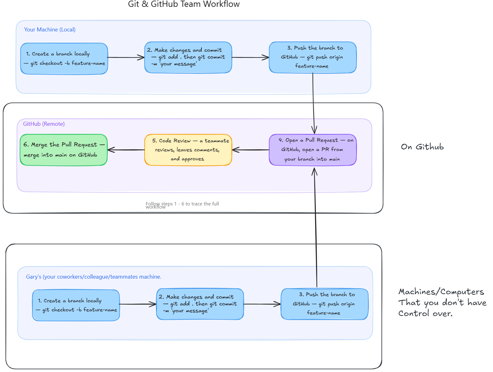
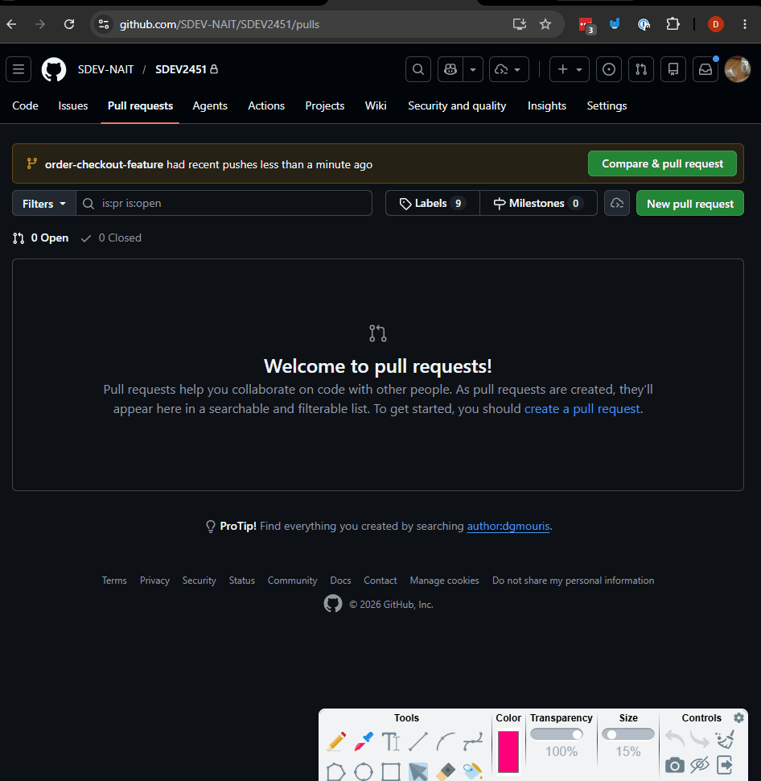

# Building in Teams — Ticketmono

This example will follow the process of building features, and fixing bugs in a full stack application as a team.

We'll be doing this by implementing features by creating pull requests and doing code reviews on the pull requests that will simulate how you work together in teams in the real world. This will involve working on the same codebase on collaborative features. This will give you the foundation of how to work on the final project.

In this example we'll be creating a pull request for the ordering feature that will allow users to checkout and get tickets for the application.

## Prerequisites

### Backend
- Create a virtual environment inside `ticketmono_backend/` and install packages from `requirements.txt`.
- Run `python manage.py migrate` to apply migrations.
- Run `python manage.py runserver`.

### Frontend
- Run `npm install` inside `ticketmono_frontend/`.
- Run `npm run dev`.

---

## Loading Sample Data

The project includes sample data so you can explore the application without building everything from scratch.

> **Run all commands from inside `ticketmono_backend/` with your virtual environment active.**

### Create the organizer accounts and load sample data

A management command has already been created for you at `core/management/commands/create_organizers.py`. Run it to create the two organizer accounts with properly hashed passwords, then load the venues, events, and ticket tiers.

```
python manage.py create_organizers
python manage.py loaddata event_data.json
```

The `create_organizers` command is safe to re-run — it skips any user that already exists.

---

## How to Make a Change to a Large Project



### 1. **Create a branch locally** — `git checkout -b feature-name`

A branch is a seperate line of development that allows you to work on a feature without affecting the main codebase. You can create a branch using the `git checkout -b` command followed by the name of your feature. For example, if you're working on a new login feature, you might create a branch called `login-feature` with the command `git checkout -b login-feature`. This will create a new branch and switch you to that branch so you can start making changes.

You will be creating branches for all features or bugs that are assigned to you.

### 1. **Make changes and commit** — `git add .` then `git commit -m 'your message'`

This step is what you folks are familiar with. You make changes to the codebase to implement the feature or changes. You use the same process that you folks have been using throughout your courses.

### 3. **Push the branch to GitHub** — `git push origin feature-name`

Once you've finished your changes and committed them locally this step pushes up the branch to github.

### 4. **Open a Pull Request** — on GitHub, open a PR from your branch into `main`

This step is where you open a pull request on Github. We'll be discussing this a bit more so that you folks know what to put as the title and description of the pull request and how to link it to github issues (discussed in later classes).

### 5. **Code Review** — a teammate reviews, leaves comments, and approves

This step is where your teammates will review the code that you've written.

This is a bit like how I and other instructors review your code in courses and give you feedback.

### 6. **Merge the Pull Request** — merge into `main` on GitHub

This is the final step where you or your teammates will merge the pull request into the main branch and make it part of the source of truth for the project.

---

## Steps

### 1. Create a Command to Visualize Your Branch History

When working in teams, it's useful to see how your branches relate to each other and when they diverged or merged. Git ships with a built-in way to do this, but the default `git log` command is hard to read. A **git alias** lets you create a shortcut for a longer command.

Run this once to set up the alias globally (you only need to do this once per machine):

```
git config --global alias.graph "log --oneline --graph"
```

After that, you can run this anywhere inside any git repository:

```
git graph
```

This will display a compact, ASCII-art graph of your commit history with branch and merge lines.

> **Tip:** Add `--all` to see every branch, including remote-tracking branches:
> ```
> git graph --all
> ```
> This is especially useful when teammates have pushed branches you haven't checked out locally yet.

---

### 2. Create a Branch for the Order Checkout Feature

In a real team project, each new feature or bug fix lives on its own branch so that multiple people can work simultaneously without stepping on each other's changes. `main` always stays stable — work-in-progress never lands there until it has been reviewed and approved.

For this example, you are implementing the order checkout feature. Create a branch for it now:

```
git checkout -b order-checkout-feature
```

This does two things at once: it creates the new branch **and** switches you to it. Any commits you make from this point will belong to `order-checkout-feature` and will not affect `main` until you open a pull request and merge.

You can confirm you're on the right branch with:

```
git branch
```

The active branch will be highlighted with an asterisk (`*`).

> **Why a separate branch for every feature?**
> When teammates each work on their own branch, GitHub can show exactly what changed, who changed it, and why — all in one pull request. It also means a broken feature can be discarded or fixed without touching anyone else's work.

_Note_ This is step 1 of the process of making a change to a large project, if you're referring to the diagram above.

---

### 3. Add a "Place Order" Button to the Checkout Page

A common real-world practice is to **build the UI first** and wire it up to the backend later. This lets the frontend team make visible progress, get feedback on the design, and keep the feature moving even before the API endpoint exists.

Open `ticketmono_frontend/src/pages/attendee/CheckoutPage.jsx` and add a **Place Order** button below the order total. The button sits inside the existing `cartItems.length > 0` block, so it only appears when there is actually something in the cart.

```jsx
<div className="mt-6">
  <button className="btn btn-primary w-full">
    Place Order
  </button>
</div>
```

Add it right after the total row, so the full bottom of the cart section looks like this:

```jsx
<div className="flex justify-between pt-4 font-bold text-lg">
  <span>Total</span>
  <span>${grandTotal.toFixed(2)}</span>
</div>
<div className="mt-6">
  <button className="btn btn-primary w-full">
    Place Order
  </button>
</div>
```

The button does nothing yet — there is no `onClick` handler. That is intentional. In a later step you will connect it to the backend API to create a real order. For now it is a **placeholder** that lets you verify the layout looks correct before any backend work begins.

**Git graph** after creating the branch and making this change you can see the following:
```
$ git commit -m "Added Static Button for Place Order"
[order-checkout-feature 39facdd] Added Static Button for Place Order
 2 files changed, 39 insertions(+)

$ git graph
* 39facdd (HEAD -> order-checkout-feature) Added Static Button for Place Order
* dff38d6 (origin/main, main) Added step 2 of creating a pull request
---
Let's talk about what's going on here.
- The `git commit` command creates a new commit with the message "Added Static Button for Place Order". This commit is added to the `order-checkout-feature` branch.
- The `git graph` command shows the commit history in a visual format. You can see that the `order-checkout-feature` branch has one commit (39facdd) that is not in the `main` branch (dff38d6). This indicates that the changes you made are currently only in the `order-checkout-feature` branch and have not been merged into `main` yet.
- The `HEAD` pointer is currently on the `order-checkout-feature` branch because you are working on that branch. The `origin/main` indicates that the `main` branch is tracking the remote branch on GitHub.

---

### 4. Add Backend Serializers for Creating an Order

Now that the frontend has a placeholder button, it's time to start building the backend side of the feature. The first backend piece is the **serializer** — the class that validates the incoming data before anything gets written to the database.

Open `ticketmono_backend/event_tickets/serializers.py` and add the following two classes at the bottom of the file:

```python
class CreateNewOrderItemSerializer(serializers.Serializer):
    event_id = serializers.IntegerField()
    ticket_tier_id = serializers.IntegerField()
    quantity = serializers.IntegerField(min_value=1)


class CreateNewOrderSerializer(serializers.Serializer):
    items = CreateNewOrderItemSerializer(many=True)
```

**What each class does:**

- `CreateNewOrderItemSerializer` validates a single line item from the cart. It expects three fields:
  - `event_id` — the ID of the event the ticket belongs to
  - `ticket_tier_id` — the specific tier (e.g. General Admission, VIP) the customer selected
  - `quantity` — how many tickets they want (must be at least 1)
- `CreateNewOrderSerializer` is the top-level serializer for the entire order. It wraps a list of items using `many=True`, so one request can contain multiple line items at once — just like a real shopping cart.

**Why plain `Serializer` instead of `ModelSerializer`?**

There is no `OrderItem` model in the database — the `Order` model stores a M2M relationship directly to `Ticket` rows. These serializers exist purely to **validate the incoming request payload** before any database work happens. A plain `serializers.Serializer` is the right tool when the shape of the input doesn't map 1-to-1 to a single model.

> **Note:** No view is wired up to these serializers yet — that comes in a later step. For now, having the serializers in place means the backend developer has done their part and the two halves of the feature are ready to be connected.

---

### 5. Add a Read Serializer for the Order

The `CreateNewOrderSerializer` from the last step is for **input** — it validates what comes *in* from the frontend. Now add a serializer for **output** — what gets sent *back* to the frontend once an order exists.

Open `ticketmono_backend/event_tickets/serializers.py` and add `OrderSerializer` at the bottom:

```python
class OrderSerializer(serializers.ModelSerializer):
    class Meta:
        model = Order
        fields = ("id", "customer", "tickets", "created_at")
```

This is a standard `ModelSerializer`. It maps directly to the `Order` model and exposes four fields:

| Field | What it contains |
|---|---|
| `id` | The primary key of the order |
| `customer` | The ID of the user who placed the order |
| `tickets` | A list of ticket IDs belonging to the order |
| `created_at` | When the order was created |

**`ModelSerializer` vs plain `Serializer`**

The `CreateNewOrderSerializer` you wrote in the last step was a plain `serializers.Serializer` because its shape didn't match a single model — it was custom input validation. `OrderSerializer` is a `ModelSerializer` because the output *does* map directly to the `Order` model. DRF can introspect the model and generate the fields automatically, so you only need to declare which ones to include in `fields`.

> **Note:** No view uses this serializer yet. You will wire it up when building the order endpoint in a later step.

---

### 6. Create the Order ViewSet

Now that you have serializers for both input and output, you can build the view that ties them together. Open `ticketmono_backend/event_tickets/views.py` and add the `OrderViewSet` class.

First, update the imports at the top of the file:

```python
from rest_framework import status, viewsets
from rest_framework.permissions import IsAuthenticated
from rest_framework.response import Response

from .models import Event, Order, Ticket, TicketTier
from .serializers import (
    CreateNewOrderSerializer,
    EventListReadOnlySerializer,
    OrderSerializer,
)
```

Then add the viewset below `EventViewSet`:

```python
class OrderViewSet(viewsets.ModelViewSet):
    serializer_class = OrderSerializer
    permission_classes = (IsAuthenticated,)

    def get_queryset(self):
        return Order.objects.filter(customer=self.request.user)

    def create(self, request, *args, **kwargs):
        serializer = CreateNewOrderSerializer(data=request.data)
        serializer.is_valid(raise_exception=True)

        tickets = []
        for item in serializer.validated_data["items"]:
            tier = TicketTier.objects.get(id=item["ticket_tier_id"])
            for _ in range(item["quantity"]):
                tickets.append(Ticket.objects.create(tier=tier))

        order = Order.objects.create(customer=request.user)
        order.tickets.set(tickets)

        return Response(OrderSerializer(order).data, status=status.HTTP_201_CREATED)
```

**How the `create` method works step by step:**

1. **Validate the request** — `CreateNewOrderSerializer` checks that every item has a valid `event_id`, `ticket_tier_id`, and a `quantity` of at least 1. If anything is missing or wrong, DRF returns a 400 error automatically thanks to `raise_exception=True`.
2. **Create the tickets** — For each item in the cart, the code fetches the matching `TicketTier` and then creates one `Ticket` row per seat. If the customer wants 3 General Admission tickets, 3 separate `Ticket` rows are inserted.
3. **Create the order** — A new `Order` is created and assigned to `request.user` (the logged-in customer). `order.tickets.set(tickets)` links all the newly created tickets to that order in a single call.
4. **Return the response** — `OrderSerializer` serializes the finished order and it is returned with a `201 Created` status.

**Why does `get_queryset` filter by `customer`?**

Without this filter, any authenticated user could fetch any order. Filtering by `request.user` means each customer only ever sees their own orders — a basic but essential security boundary.

Finally, register the new viewset in `ticketmono_backend/event_tickets/urls.py`:

```python
from .views import EventViewSet, OrderViewSet

router.register("orders", OrderViewSet, basename="order")
```

The router automatically generates these endpoints:

| Method | URL | Action |
|---|---|---|
| `POST` | `/api/orders/` | Create a new order (checkout) |
| `GET` | `/api/orders/` | List the current user's orders |
| `GET` | `/api/orders/<id>/` | Retrieve a single order |

---

### 7. Commit Your Changes

Now that the backend serializers and viewset are in place, commit everything so there is a clear record of this work in the branch history.

Stage all the files you changed and commit with a descriptive message:

```
git add .
git commit -m "Add order checkout serializer and viewset"
```

**Why commit messages matter in a team**

In a solo project a vague message like `"stuff"` or `"wip"` only hurts you. In a team it hurts everyone. A teammate reviewing your pull request, a future developer tracking down a bug with `git log`, or even you coming back to this branch after a weekend — all of them rely on commit messages to understand *what* changed and *why*.

A good commit message:
- Uses the imperative mood — `"Add"`, `"Fix"`, `"Update"` — not `"Added"` or `"Adding"`
- Summarises the change in under 72 characters
- Focuses on *what* the change does, not how the code works

`"Add order checkout serializer and viewset"` follows all three rules. It tells anyone reading the log exactly what this commit introduces without them needing to open a single file.

After committing, run `git graph` to see your branch diverge from `main`:

```
* <new hash>  (HEAD -> order-checkout-feature) Add order checkout serializer and viewset
* <prev hash> Added Static Button for Place Order
* <hash>      (origin/main, main) ...
```

---

### 8. Push the Branch to GitHub

With the commit saved locally, push the branch to GitHub so your teammates can see it:

```
git push origin order-checkout-feature
```

This uploads your `order-checkout-feature` branch to the remote repository. It does **not** touch `main` — your changes are still isolated on their own branch until a pull request is opened and merged.

> **Note:** If this is the first time you push this branch, Git may ask you to set the upstream. Run the command exactly as shown — `git push --set-upstream origin order-checkout-feature` — and Git will create the remote branch automatically.


### 9. Open a Draft Pull Request on Github.

We know this pull request

The process of creating a pull request on GitHub is shown in the image below.


Let's talk about what is going in this image.
1. The user clicks "Pull Requests" in the Github UI to go to the Pull Requests page for the repository.
2. The user clicks the "New Pull Request" button to start creating a new pull request
3. The user selects the `order-checkout-feature` branch as the source and `main` as the target for the pull request.
4. The user clicks "Create Pull Request" to open the pull request, after adding some details about the changes they made in a pull requests description. The pull Request is created! Woo!
5. The user converts the pull request to a draft since the feature isn't fully complete yet, but this way team members can add comments and feedback on the work in progress. This is important because it allows for early feedback and collaboration before the feature is fully finished, which can save time and prevent going too far down the wrong path.
6. The user clicks commits to see the commits that are part of this pull request. This is where the commit messages you wrote earlier become important, as they help reviewers understand the history of changes in this pull request.
7. The user clicks "Files changed" to see the actual code changes that are part of this pull request. This is where reviewers will spend most of their time, reading through the diffs and leaving comments or suggestions for improvements.

**Why push before you're "done"?**

Pushing early makes your work visible. Teammates can:
- Leave early feedback before you've gone too far in the wrong direction
- See what you're working on so they don't accidentally build the same thing
- Open a **draft pull request** to start the code review conversation even before the feature is complete

---

### 10. Create the API Function for Placing an Order

The backend endpoint `POST /api/orders/` is ready. The next step is to give the frontend a way to call it. Following the same pattern used for `events.js`, create a new file `ticketmono_frontend/src/api/orders.js`:

```javascript
import apiClient from './client'

export async function createOrder(items) {
  const res = await apiClient('/orders/', {
    method: 'POST',
    body: JSON.stringify({ items }),
  })
  if (!res.ok) throw new Error('Failed to create order.')
  return res.json()
}
```

`createOrder` accepts an array of items — each with `event_id`, `ticket_tier_id`, and `quantity` — wraps them in the `{ items }` shape the backend expects, and throws an error if the response is not OK so TanStack Query can surface it.

---

### 11. Create the `useCreateOrder` Hook

API functions on their own don't manage loading state, errors, or success callbacks. That's what TanStack Query's `useMutation` is for. Create `ticketmono_frontend/src/hooks/useCreateOrder.js`:

```javascript
import { useMutation } from '@tanstack/react-query'
import { createOrder } from '../api/orders'

export function useCreateOrder() {
  return useMutation({
    mutationFn: createOrder,
  })
}
```

`useMutation` returns an object that includes:

| Value | What it gives you |
|---|---|
| `mutate` | The function you call to trigger the request |
| `isPending` | `true` while the request is in flight |
| `isSuccess` | `true` once the server responds with success |
| `isError` | `true` if the request fails |

This hook follows the same convention as `useEvents` and `useEvent` — the hook owns the async state and the component just calls it.

---

### 12. Wire Up the "Place Order" Button

Now connect the hook to the checkout page. Open `ticketmono_frontend/src/pages/attendee/CheckoutPage.jsx` and make three changes:

**1. Import the hook:**

```javascript
import { useCreateOrder } from '../../hooks/useCreateOrder'
```

**2. Destructure the values you need and add a handler:**

```javascript
const { mutate, isPending, isSuccess } = useCreateOrder()

function handlePlaceOrder() {
  const orderItems = cartItems.map((item) => ({
    event_id: item.eventId,
    ticket_tier_id: item.tierId,
    quantity: item.quantity,
  }))
  mutate(orderItems)
}
```

`handlePlaceOrder` maps the cart items — which use camelCase keys like `eventId` — into the snake_case shape the backend serializer expects.

**3. Add a success screen and update the button:**

Add a guard before the main `return` that renders a confirmation message when the order succeeds:

```jsx
if (isSuccess) {
  return (
    <div className="max-w-2xl mx-auto px-4 py-8">
      <h1 className="text-2xl font-bold mb-4">Order Placed!</h1>
      <p className="text-base-content/60">Thank you for your order.</p>
    </div>
  )
}
```

Update the button to disable itself while the request is in flight and show feedback:

```jsx
<button
  className="btn btn-primary w-full"
  onClick={handlePlaceOrder}
  disabled={isPending}
>
  {isPending ? 'Placing Order...' : 'Place Order'}
</button>
```

`disabled={isPending}` prevents the customer from clicking twice and accidentally submitting the same order. The label change from `'Place Order'` to `'Placing Order...'` gives immediate visual feedback that something is happening.

> **Why split this across three files?**
> Each layer has one job: `orders.js` knows how to talk to the API, `useCreateOrder.js` manages async state, and `CheckoutPage.jsx` renders the UI. This separation makes each piece easy to test and reuse independently — a pattern you'll see in every professional React codebase.

---

### 13. Commit, Push, and Update the Pull Request

The frontend is now connected to the backend. Commit those changes, push them up, and let GitHub automatically add the new commit to your open pull request.

Run these three commands in order:

```
git add .
git commit -m "Connect frontend to backend for order checkout"
git push origin order-checkout-feature
```
Note: since we used `--set-upstream` the first time we pushed this branch, you can just run `git push` without the `origin order-checkout-feature` and Git will know where to push.

**What each command does:**

- `git add .` — stages every changed and new file in the working directory so they are included in the next commit
- `git commit -m "Connect frontend to backend for order checkout"` — creates a snapshot of those staged changes with a message that clearly describes what this commit accomplishes
- `git push origin order-checkout-feature` — uploads the new commit to the remote branch on GitHub

**The pull request updates automatically**

You don't need to close and reopen the pull request. As soon as the push lands, GitHub adds the new commit to the existing PR. Anyone already reviewing it will see the updated diff and the new commit in the timeline. This is the normal rhythm of a feature branch: commit locally, push, and the PR reflects your latest work.

You need take a look at the "Commits" and "Files Changed" to ensure that the new commit is part of the pull request and that the code changes are correct. This is also a good time to add a comment in the pull request description or in the new commit message to explain that this commit connects the frontend to the backend for the order checkout feature, so reviewers know what to look for when they review the code.

**Important Note** Next class we'll perform a code review on this pull request and merge it into `main`, so make sure to have this step completed before then!

---

## Conclusion

You've now gone through the full lifecycle of building a feature on a team:

1. Set up a `git graph` alias to visualize your branch history
2. Created a dedicated feature branch so your work stays isolated from `main`
3. Built the UI first with a placeholder button, then filled in the backend
4. Added input serializers to validate the checkout payload
5. Added an output serializer to shape what gets returned to the frontend
6. Created a viewset with a custom `create` method that turns validated data into real database records
7. Created an API function and a `useCreateOrder` hook to call the endpoint from React
8. Wired up the button so clicking it sends the order to the backend and shows a confirmation
9. Committed each logical chunk of work with a clear message
10. Pushed the branch and opened a draft pull request so teammates could see progress early

**Before next class**, visit the pull request on GitHub and do a final check:

- Open the **Commits** tab and confirm both commits are listed — `"Add order checkout serializer and viewset"` and `"Connect frontend to backend for order checkout"`
- Open the **Files changed** tab and read through the diff as if you were the reviewer. Does every change make sense? Are there any leftover debug lines or commented-out code that shouldn't be there?
- Check that the pull request title and description give a reviewer enough context to understand what the feature does without having to read every line of code

Getting into the habit of reviewing your own pull request before asking a teammate to look at it is one of the most effective things you can do to speed up code reviews and produce cleaner work.

